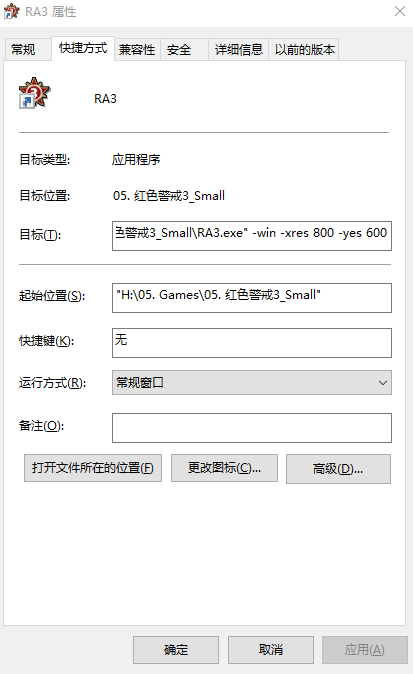

[TOC]


# 激活命令

1. 卸载原有激活信息 `slmgr.vbs /upk`
2. 使用密钥激活 `slmgr /ipk xxxx-xxxx-xxxx-xxxx-xxxx`
3. 查看win10是否已永久激活`slmgr.vbs -xpr`
4. 查询激活信息(激活ID,安装ID等等) `slmgr.vbs -dlv

你可能看到这样的激活流程
1. 移除原有激活信息`slmgr.vbs /upk`
2. 使用密钥激活`slmgr /ipk xxxx-xxxx-xxx`
3. 更改密钥管理服务器激活中心 `slmgr /skms kms.xspace.in`
4.`slmgr /ato`


# 快捷键
1. 调出虚拟桌面 win+TAB
2. 切换不同窗口 Alt+Tab
3. 创建新的虚拟桌面 win+Ctrl+D
4. 关闭当前当前虚拟桌面 win+ctrl+F4
5. 切换虚拟桌面Ctrl+win+左右箭头。
6. 激活注册命令slmgr/ipk W269N-WFGWX-YVC9B-4J6C9-T83GX && slmgr/skms kms.xspace.in && slmgr/ato
激活代码如上 
查看代码如下
slmgr.vbs -xpr
添加开机启动项目：将应用的快捷方式添加至启动文件夹两种方式
1. 添加至系统启动文件夹成 `cd /d C:\ProgramData\Microsoft\Windows\Start Menu\Programs\Startup && start .` ,将要开机启动的应用的快捷方式放在该文件夹中。
2. 不添加至系统启动文件夹添加至个人的开机启动文件夹`cd /d C:\Users\leemoaly\AppData\Roaming\Microsoft\Windows\Start Menu\Programs\Startup` 放入应用的快捷方式。

# 查看文件的MD5 ，SHA1和SHA256
```
certutil -hashfile yourfilename MD5

certutil -hashfile yourfilename SHA1

certutil -hashfile yourfilename SHA256
```

> 注意filename必须是绝对路径

# 显示Windows10的


```
Windows Registry Editor Version 5.00

; Change Extension's File Type 

[HKEY_CURRENT_USER\Software\Classes\.jpg] 

@="PhotoViewer.FileAssoc.Tiff" 

; Change Extension's File Type 

[HKEY_CURRENT_USER\Software\Classes\.jpeg] 

@="PhotoViewer.FileAssoc.Tiff" 

; Change Extension's File Type 

[HKEY_CURRENT_USER\Software\Classes\.gif] 

@="PhotoViewer.FileAssoc.Tiff" 

; Change Extension's File Type 

[HKEY_CURRENT_USER\Software\Classes\.png] 

@="PhotoViewer.FileAssoc.Tiff" 

; Change Extension's File Type 

[HKEY_CURRENT_USER\Software\Classes\.bmp] 

@="PhotoViewer.FileAssoc.Tiff" 

; Change Extension's File Type 

[HKEY_CURRENT_USER\Software\Classes\.tiff] 

@="PhotoViewer.FileAssoc.Tiff" 

; Change Extension's File Type 

[HKEY_CURRENT_USER\Software\Classes\.ico] 

@="PhotoViewer.FileAssoc.Tif
```

# 命令行连接wifi
`netsh wlan connect name = wifiname`

删除win10自带的应用在管理员模式下的PowerShell中输入`Get-AppxPackage | Remove-AppxPackage

重置系统应用
```
Get-AppxPackage -AllUsers| Foreach {Add-AppxPackage -DisableDevelopmentMode -Register "$($_.InstallLocation)\AppXManifest.xml"}
```

```
Windows Registry Editor Version 5.00

[HKEY_USERS\S-1-5-21-2181940841-2130835284-3393570551-1001\Software\Microsoft\Windows\CurrentVersion\ContentDeliveryManager\SuggestedApps]
"41038Axilesoft.ACGMediaPlayer_wxjjre7dryqb6"=dword:00000001
"64885BlueEdge.OneCalendar_8kea50m9krsh2"=dword:00000001
"828B5831.HiddenCityMysteryofShadows_ytsefhwckbdv6"=dword:00000001
"828B5831.TheSecretSociety-HiddenMystery_ytsefhwckbdv6"=dword:00000001
"A278AB0D.DragonManiaLegends_h6adky7gbf63m"=dword:00000001
"D52A8D61.FarmVille2CountryEscape_jwbwg6xx0377a"=dword:00000001
"Drawboard.DrawboardPDF_gqbn7fs4pywxm"=dword:00000001
"GAMELOFTSA.Asphalt8Airborne_0pp20fcewvvtj"=dword:00000001
"Microsoft.AgeCastles_8wekyb3d8bbwe"=dword:00000001
"Microsoft.MinecraftUWP_8wekyb3d8bbwe"=dword:00000001
"NeteaseYoudao.18692F27B7C6F_7x355j7kq8bfj"=dword:00000001
"ThumbmunkeysLtd.PhototasticCollage_nfy108tqq3p12"=dword:00000001
"flaregamesGmbH.RoyalRevolt2_g0q0z3kw54rap"=dword:00000001
"WinZipComputing.WinZipUniversal_3ykzqggjzj4z0"=dword:00000001
"89006A2E.AutodeskSketchBook_tf1gferkr813w"=dword:00000001
"A278AB0D.DisneyMagicKingdoms_h6adky7gbf63m"=dword:00000001
"A278AB0D.MarchofEmpires_h6adky7gbf63m"=dword:00000001
"DolbyLaboratories.DolbyAccess_rz1tebttyb220"=dword:00000001
"Microsoft.MSPaint_8wekyb3d8bbwe"=dword:00000001
"Microsoft.MicrosoftSolitaireCollection_8wekyb3d8bbwe"=dword:00000001
"king.com.BubbleWitch3Saga_kgqvnymyfvs32"=dword:00000001
"king.com.CandyCrushSodaSaga_kgqvnymyfvs32"=dword:00000001
"Microsoft.BingWeather_8wekyb3d8bbwe"=dword:00000001


```


```
Windows Registry Editor Version 5.00

[HKEY_LOCAL_MACHINE\SOFTWARE\Microsoft\Windows\CurrentVersion\InstallAgent\CategoryCache]
"a3ad7560-4be4-5c6d-58c6-6189e443332aCN"="{\"ProductId\":\"9NBLGGH6G0JF\",\"SkuId\":\"0010\",\"PackageFamilyName\":\"1F8B0F94.122165AE053F_j2p0p5q0044a6\",\"ProductTitle\":\"网易云音乐UWP\",\"WuCategoryId\":\"d4d89a23-7d94-438e-9df0-071fa623b955\"}"
"5d967502-cace-3f7b-f464-8e7af2dc2c5fCN"="{\"ProductId\":\"9NBLGGH4VZW5\",\"SkuId\":\"0010\",\"PackageFamilyName\":\"89006A2E.AutodeskSketchBook_tf1gferkr813w\",\"ProductTitle\":\"Autodesk SketchBook\",\"WuCategoryId\":\"1ccf1242-6425-4e6c-8a25-1024d23c526a\"}"
"93ef147a-744b-7e02-07e6-7dbc2b2fa9cbCN"="{\"ProductId\":\"9NBLGGH6BNG3\",\"SkuId\":\"0010\",\"PackageFamilyName\":\"A278AB0D.DisneyMagicKingdoms_h6adky7gbf63m\",\"ProductTitle\":\"迪士尼梦幻王国\",\"WuCategoryId\":\"a24acd64-2bd9-4471-b485-b905314f74aa\"}"
"1fe89c0b-9bed-cc5d-7426-9e4025d6bdd9CN"="{\"ProductId\":\"9NBLGGH10PG8\",\"SkuId\":\"0010\",\"PackageFamilyName\":\"Microsoft.People_8wekyb3d8bbwe\",\"WuCategoryId\":\"cfc4a10e-0356-451d-bb3e-c4fe5edfd20c\"}"
"252e54bd-43ce-0ddc-be69-eeafa274f177CN"="{\"ProductId\":\"9N0866FS04W8\",\"SkuId\":\"0100\",\"PackageFamilyName\":\"DolbyLaboratories.DolbyAccess_rz1tebttyb220\",\"ProductTitle\":\"Dolby Access\",\"WuCategoryId\":\"598daf0f-75c2-4472-8ad6-1afa0446f8ba\"}"
"007cac78-c79b-923b-71a8-b5dfae2af4c2CN"="{\"ProductId\":\"9NBLGGH1ZRPV\",\"SkuId\":\"0010\",\"PackageFamilyName\":\"king.com.CandyCrushSodaSaga_kgqvnymyfvs32\",\"ProductTitle\":\"Candy Crush Soda Saga\",\"WuCategoryId\":\"25316f12-963a-4d4e-b782-b74e97666bae\"}"
"29cc2b0a-897f-1900-95d7-2966bd72e071CN"="{\"ProductId\":\"9NBLGGH33ZDV\",\"SkuId\":\"0010\",\"PackageFamilyName\":\"A278AB0D.MarchofEmpires_h6adky7gbf63m\",\"ProductTitle\":\"帝国霸略\",\"WuCategoryId\":\"de351fad-644d-4c56-affc-a5f6cb2c7f36\"}"
"e41cca53-079b-00ca-12de-c1a2cdac8087CN"="{\"ProductId\":\"9NBLGGH5Q1ZL\",\"SkuId\":\"0010\",\"PackageFamilyName\":\"WinZipComputing.WinZipUniversal_3ykzqggjzj4z0\",\"ProductTitle\":\"WinZip Universal\",\"WuCategoryId\":\"5f8c40df-bbfb-481b-aaf2-642c8eb748b9\"}"
"70bc17f8-0aa7-cb35-cee0-ef1b47a0fd3eCN"="{\"ProductId\":\"9NBLGGH42THS\",\"SkuId\":\"0010\",\"PackageFamilyName\":\"Microsoft.Microsoft3DViewer_8wekyb3d8bbwe\",\"WuCategoryId\":\"0c7d3085-6c21-49a1-b267-52fdd722ca9d\"}"
"62b49c0a-499e-a02d-ebcb-eb168e148e52CN"="{\"ProductId\":\"9NBLGGH4LS1F\",\"SkuId\":\"0010\",\"PackageFamilyName\":\"Microsoft.StorePurchaseApp_8wekyb3d8bbwe\",\"WuCategoryId\":\"214308d7-4262-449d-a78d-9a2306144b11\"}"
"0251d65d-e887-28bd-a226-3ecd72fb59c6CN"="{\"ProductId\":\"9NBLGGH537C2\",\"SkuId\":\"0010\",\"PackageFamilyName\":\"Microsoft.XboxGameOverlay_8wekyb3d8bbwe\",\"WuCategoryId\":\"be437d05-6d78-42b6-9bc1-d38c6de4a43d\"}"
"49f33c48-b2de-f82a-56f2-64425f298b84CN"="{\"ProductId\":\"9NBLGGH5FV99\",\"SkuId\":\"0010\",\"PackageFamilyName\":\"Microsoft.MSPaint_8wekyb3d8bbwe\",\"WuCategoryId\":\"eb8c95fe-7294-45c1-8768-73cc6a769307\"}"
"557ea3bb-623e-add9-4dfb-629a8648a038CN"="{\"ProductId\":\"9NBLGGH5PNB1\",\"SkuId\":\"0010\",\"PackageFamilyName\":\"Microsoft.OneConnect_8wekyb3d8bbwe\",\"WuCategoryId\":\"86a75d59-8166-4e92-9f46-f3b39784ada3\"}"
"bbfd7549-71ae-d8fd-9f58-2ef4c874b21cCN"="{\"ProductId\":\"9NKNC0LD5NN6\",\"SkuId\":\"0010\",\"PackageFamilyName\":\"Microsoft.Xbox.TCUI_8wekyb3d8bbwe\",\"WuCategoryId\":\"2830b57a-d6c7-4c7a-873e-ad2365cdf2bf\"}"
"a715d489-c343-f20b-b22e-f8d749061b0cCN"="{\"ProductId\":\"9P086NHDNB9W\",\"SkuId\":\"0010\",\"PackageFamilyName\":\"Microsoft.XboxSpeechtoTextOverlay_8wekyb3d8bbwe\",\"WuCategoryId\":\"253402b1-6356-4131-b1cd-f4f3b6d2b03c\"}"
"6da3d5c0-a460-4e4e-3b2a-8530bc7cafdaCN"="{\"ProductId\":\"9PBPCH085S3S\",\"SkuId\":\"0010\",\"PackageFamilyName\":\"Microsoft.Print3D_8wekyb3d8bbwe\",\"WuCategoryId\":\"6c3c7ef3-20fc-43a8-8ce2-1a89f35a1476\"}"
"fb06ef95-bc48-1a6a-26fb-4450ce9a5906CN"="{\"ProductId\":\"9PKDZBMV1H3T\",\"SkuId\":\"0010\",\"PackageFamilyName\":\"Microsoft.GetHelp_8wekyb3d8bbwe\",\"WuCategoryId\":\"20f45068-02fc-4701-9385-53ac85d8eaf9\"}"
"facf9dde-1ff1-b57d-4d1d-ce479fdd42afCN"="{\"ProductId\":\"9WZDNCRD29V9\",\"SkuId\":\"0010\",\"PackageFamilyName\":\"Microsoft.MicrosoftOfficeHub_8wekyb3d8bbwe\",\"WuCategoryId\":\"eaac6c6b-10a4-4659-815b-44f151eca61a\"}"
"104355d6-f83d-3ed7-0266-cc434e85c52cCN"="{\"ProductId\":\"9PHNB71MKR4J\",\"SkuId\":\"0010\",\"PackageFamilyName\":\"king.com.BubbleWitch3Saga_kgqvnymyfvs32\",\"ProductTitle\":\"泡泡魔女传奇3\",\"WuCategoryId\":\"ed49155c-371f-4fad-a441-36380f1f98a5\"}"
"a90b8400-d36d-8235-8bf2-a21a53d3fb65CN"="{\"ProductId\":\"9WZDNCRDTBVB\",\"SkuId\":\"0010\",\"PackageFamilyName\":\"Microsoft.WindowsMaps_8wekyb3d8bbwe\",\"WuCategoryId\":\"733893b8-533d-4292-bf27-23d218b39a95\"}"
"e336bb8f-16ed-7cbe-afee-971dd3041585CN"="{\"ProductId\":\"9WZDNCRFHVJL\",\"SkuId\":\"0010\",\"PackageFamilyName\":\"Microsoft.Office.OneNote_8wekyb3d8bbwe\",\"WuCategoryId\":\"f022389f-f3a6-417e-ad23-704fbdf57117\"}"
"6ea6fc2e-9305-586b-3411-02826d151533CN"="{\"ProductId\":\"9WZDNCRFHVQM\",\"SkuId\":\"0010\",\"PackageFamilyName\":\"microsoft.windowscommunicationsapps_8wekyb3d8bbwe\",\"WuCategoryId\":\"64a79953-cf0b-44f9-b5c4-ee5df3a15c63\"}"
"00d57b0f-01fa-b79f-08d6-878ed20c4c9bCN"="{\"ProductId\":\"9WZDNCRFHWD2\",\"SkuId\":\"0010\",\"PackageFamilyName\":\"Microsoft.MicrosoftSolitaireCollection_8wekyb3d8bbwe\",\"WuCategoryId\":\"1a36fd17-5161-4651-ae2d-13384e427ea8\"}"
"0c8cf327-9d17-ccde-18af-dff4f20070e5CN"="{\"ProductId\":\"9WZDNCRFHWKN\",\"SkuId\":\"0010\",\"PackageFamilyName\":\"Microsoft.WindowsSoundRecorder_8wekyb3d8bbwe\",\"WuCategoryId\":\"9f03273f-fe0b-4ed8-9bc8-c2f256375490\"}"
"e6d3b497-80af-7f14-f9e6-9606ee369fc3CN"="{\"ProductId\":\"9WZDNCRFJ364\",\"SkuId\":\"0010\",\"PackageFamilyName\":\"Microsoft.SkypeApp_kzf8qxf38zg5c\",\"WuCategoryId\":\"5e19cc61-8994-4797-bdc7-c21263f6282b\"}"
"69f3bcab-8975-c526-30f5-39fa70c77ad9CN"="{\"ProductId\":\"9WZDNCRFJ3P2\",\"SkuId\":\"0010\",\"PackageFamilyName\":\"Microsoft.ZuneVideo_8wekyb3d8bbwe\",\"WuCategoryId\":\"64b22df1-5a9c-4c88-aa1f-42cefaf8b281\"}"
"18ddc675-d472-0db4-9563-7df7c34f512cCN"="{\"ProductId\":\"9WZDNCRFJ3PR\",\"SkuId\":\"0010\",\"PackageFamilyName\":\"Microsoft.WindowsAlarms_8wekyb3d8bbwe\",\"WuCategoryId\":\"579fc437-d398-411c-a6c5-d01fd4523b94\"}"
"6d151227-6bd9-726d-b30e-a8a018dcc82bCN"="{\"ProductId\":\"9WZDNCRFJ3PT\",\"SkuId\":\"0010\",\"PackageFamilyName\":\"Microsoft.ZuneMusic_8wekyb3d8bbwe\",\"WuCategoryId\":\"16db93bf-8748-449a-96ba-e9ed3a5f872d\"}"
"9d4ded89-cabc-f4fb-8133-bc5edb1c7edaCN"="{\"ProductId\":\"9WZDNCRFJBMP\",\"SkuId\":\"0010\",\"PackageFamilyName\":\"Microsoft.WindowsStore_8wekyb3d8bbwe\",\"WuCategoryId\":\"64293252-5926-453c-9494-2d4021f1c78d\"}"
"674c4c14-7baa-f782-e214-956dc3bedf39CN"="{\"ProductId\":\"9WZDNCRFJBQ6\",\"SkuId\":\"0010\",\"PackageFamilyName\":\"Microsoft.Messaging_8wekyb3d8bbwe\",\"WuCategoryId\":\"7ce6966c-0c33-4851-8958-285abba4d7cc\"}"
"97612282-d1e8-1d6a-9e92-c271e7f177efCN"="{\"ProductId\":\"9NBLGGH4NNS1\",\"SkuId\":\"0010\",\"PackageFamilyName\":\"Microsoft.DesktopAppInstaller_8wekyb3d8bbwe\",\"ProductTitle\":\"App Installer\",\"WuCategoryId\":\"f855810c-9f77-45ff-a0f5-cd0feaa945c6\"}"
"558f5d32-0827-eb7b-6ad6-d5db4138b3aaCN"="{\"ProductId\":\"9WZDNCRFJBH4\",\"SkuId\":\"0010\",\"PackageFamilyName\":\"Microsoft.Windows.Photos_8wekyb3d8bbwe\",\"WuCategoryId\":\"454a759b-ff5b-4a79-80d3-1cf15eba0908\"}"
"3bfd26c9-8da9-b940-f638-55890012aab4CN"="{\"ProductId\":\"9WZDNCRFJBBG\",\"SkuId\":\"0010\",\"PackageFamilyName\":\"Microsoft.WindowsCamera_8wekyb3d8bbwe\",\"WuCategoryId\":\"cd5d53b1-33f7-4a95-b111-f51f187c7130\"}"
"68bc3251-2d8b-a604-92ba-893638ca72eaCN"="{\"ProductId\":\"9WZDNCRFHVN5\",\"SkuId\":\"0010\",\"PackageFamilyName\":\"Microsoft.WindowsCalculator_8wekyb3d8bbwe\",\"WuCategoryId\":\"e632fe90-a5ba-43aa-bf81-9de8413e83d8\"}"
"50611331-fe19-d366-b049-694b8ac9d758CN"="{\"ProductId\":\"9WZDNCRDTBJJ\",\"SkuId\":\"0010\",\"PackageFamilyName\":\"Microsoft.Getstarted_8wekyb3d8bbwe\",\"WuCategoryId\":\"7f354d0e-a913-4aa0-815d-3fa9fbff2bd8\"}"
"0116dc02-781b-d1d1-fc1c-c80195511e17CN"="{\"ProductId\":\"9NBLGGH4R32N\",\"SkuId\":\"0010\",\"PackageFamilyName\":\"Microsoft.WindowsFeedbackHub_8wekyb3d8bbwe\",\"WuCategoryId\":\"d63c16b5-90e0-4df5-83ae-8ca6f53997d5\"}"
"68e019eb-0b92-5e08-5d86-9bfe6dba8517CN"="{\"ProductId\":\"9NBLGGH4QGHW\",\"SkuId\":\"0010\",\"PackageFamilyName\":\"Microsoft.MicrosoftStickyNotes_8wekyb3d8bbwe\",\"WuCategoryId\":\"b90f3a9a-c043-41a7-a774-e51f6069283b\"}"


```


eventvwr

# Windows的自动更新  

相关服务 `windows update, Windows Search, SuperFetch, Background Intelligent Transfer Service`, 关闭 `Windows Store` 的自动更新

C:/Program Files/WindowsApps  

您好！

我们了解到您关于Windows 10卡死的问题，

请问之后这个情况是否有重现？

建议您尝试以下方案检查您的系统组件，看看是否可行：

在管理员命令提示符下键入以下命令：sfc /SCANNOW，

 

如果检查到问题，但无法修复，你看看有使用下面的命令：

 

Dism /Online /Cleanup-Image /ScanHealth

 

这条命令将扫描全部系统文件并和官方系统文件对比，扫描计算机中的不一致情况。

 

Dism /Online /Cleanup-Image /CheckHealth

 

这条命令必须在前一条命令执行完以后，发现系统文件有损坏时使用。

 

DISM /Online /Cleanup-image /RestoreHealth

 

这条命令是把那些不同的系统文件还原成官方系统源文件。

 

完成后重启，再键入以下命令：sfc /SCANNOW，

 

检查系统文件是否被修复


另外，如果您不接受重装建议，您可以尝试以下方案，看看是否有效果：

以管理员身份运行“命令提示符”粘贴以下命令并执行：

 

dism /online /Cleanup-Image /RestoreHealth & sfc /SCANNOW?& for %d in (%windir%\system32\*.dll) do %windir%\system32\regsvr32.exe /s %d


压缩包校验值
文件: 3D Organon Anatomy 3.0.0.rar
大小: 921730764 字节
MD5: 9D8CC442198FB28164B0E509218FFB8A
SHA1: AB6AD9F51192D0D1BC5C51E27BBA2093DCB7324B
CRC32: C48DF51A  


隐藏的内容 

1.解压 分卷压缩包（3个分卷全部下载完再解压！）安装程序；

2.打开crack文件夹，将Anatomy and Physiology_Data文件夹和Anatomy and Physiology.exe复制到安装目录替换原来的文件和文件夹即可！

 解压密码:www.macxin.com
Total station unzip code:www.macxin.com


# 强制窗口化程序  

在应用启动的快捷方式上加入 `-win -xres xxxx -yres xxxx` 指令。  
  


# 自定义 Chrome 的用户数据目录

修改 chrome 的用户数据目录只需要加上 `--user-data-dir="Y:\ChromeData" --disk-cache-dir="Y:\ChromeData"` 即可，在实际使用中发现从PC应用直接跳转时并没有使用该目录作为数据缓存实际是因为修改不完全导致的，只需要在相关注册表目录加上参数即可

win10 默认浏览器通过  systemsetting.exe 来设置的，相关的注册表是

```
HKEY_CURRENT_USER\SOFTWARE\Microsoft\Windows\Shell\Associations\UrlAssociations\http\UserChoice

HKEY_CURRENT_USER\SOFTWARE\Microsoft\Windows\Shell\Associations\UrlAssociations\https\UserChoice
```

查询得到上述键值，利用 Registry Finder 查询到相关键值存在于:

```
HKEY_CLASSES_ROOT\ChromeHTML.RFJTLFATEURK22MGQVGNIDBMWA\shell\open\command
HKEY_CURRENT_USER\Software\Classes\ChromeHTML.RFJTLFATEURK22MGQVGNIDBMWA\shell\open\command
```

修改键值添加参数 `--user-data-dir="Y:\ChromeData" --disk-cache-dir="Y:\ChromeData"`

```
"C:\Users\xxxx\AppData\Local\Google\Chrome\Application\chrome.exe" -- "%1"

-->替换为

"C:\Users\xxxx\AppData\Local\Google\Chrome\Application\chrome.exe" --user-data-dir="Y:\ChromeData" --disk-cache-dir="Y:\ChromeData" -- "%1"
```

上述修改发现基本正常，但PC微信的页面用默认浏览器打开时依旧没有使用该配置参数

资料参考
[如何绕过Win8、Win10的systemsetting与注册表校验设置默认浏览器](https://cloud.tencent.com/developer/news/25845)

# 获取文件hash

利用 powershell 可以快速达到效果

```get-filehash <filename>

```

可直接输出 SHA256 的hash值