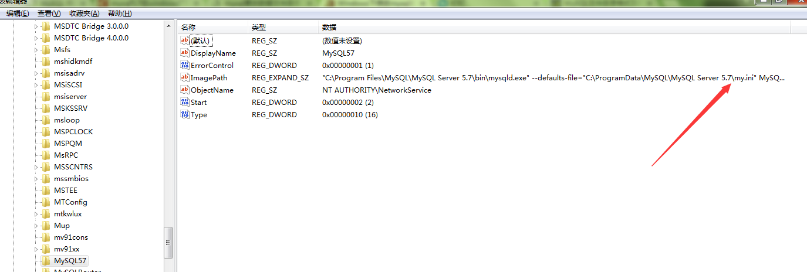
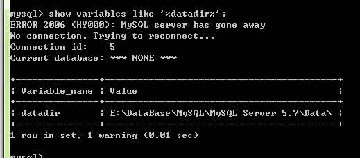

5.7版的MySQL安装时的数据库存储路径设置较深不大容易发现，在安装时要选择右下角的Advance Option才会显示自定义路径。

如果已经安装了MySQL需要自定义路径的话大步骤如下：
1. 备份现有的数据库文件
2. 修改指定数据库存储路径的配置文件
3. 重启MySQL服务

1. 首先得知道当前的数据库文件存储在哪，一般是在`C:\ProgramData\MySQL\MySQL Server 5.7\Data`,也可以通过命令行查看打开`MySQL 5.7 Command Line Client`,输入密码后通过`show variables like '%datadir%‘;`查看数据库的存储路径。

将`Data`文件夹复制至新的位置比如`E:\DataBase\MySQL\MySQL Server 5.7`.
2. 修改启动配置。先确定待修改文件的位置查看注册表`HKEY_LOCAL_MACHINE\SYSTEM\CurrentControlSet\services\MySQL57`下的`ImagePath`的值，从中可以看到我们是可以自定义相关配置文件的路径的。
  
于是我们去修改`C:\ProgramData\MySQL\MySQL Server 5.7\my.ini`文件，修改改文件的datadir的值，我是注释掉了老位置。

3. 最后关闭MySQL相关，重启一下MySQL服务。再用命令行查看数据存储路径已经是最新的了。
  

# 参考链接
1. [ mysql5.7在windows7下my.ini文件加载路径及数据位置修改](http://blog.csdn.net/qq_27680317/article/details/71107934)
2. [Windows下修改mysql的data文件夹存放位置的方法](http://www.jb51.net/article/47903.htm)