[TOC]

# 准备工作
先分析为登录状态下直接访问192.168.8.1地址的网络请求。
Fidder 代理抓取十分钟左右的网络请求，得到访问的1707条网络连接，对得到的1707网络请求通过集合Set的特性进行去重处理同时排除图片资源等文件得到8条有效api网络请求连接如下：
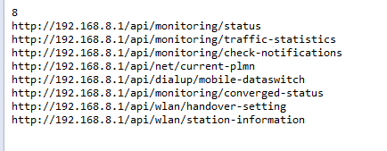  
Set去重代码如下(传递链接文件存放的地址):
```
private static void distinctData(String filepath){
        Set<String> set = new HashSet<String>();
        File file = new File(filepath);
        BufferedReader br = null;
        try {
            br = new BufferedReader(new FileReader(file));
            String result = br.readLine();
            while (result != null) {
                if(result.startsWith("http://192.168.8.1/")&&!result.endsWith(".png"))
                set.add(result);
                result = br.readLine();
            }
        } catch (IOException e) {
            // TODO Auto-generated catch block
            e.printStackTrace();
        } finally {
            if (br != null) {
                try {
                    br.close();
                } catch (IOException e) {
                    // TODO Auto-generated catch block
                    e.printStackTrace();
                }
            }
        }
        System.out.println(set.size());
        for (Iterator<String> it = set.iterator(); it.hasNext();) {
            System.out.println(it.next().toString());
        }
    }
```

去除资源文件得到9条真实api访问的网络请求，一条条分析。
```
http://192.168.8.1/api/monitoring/status
http://192.168.8.1/api/monitoring/traffic-statistics
http://192.168.8.1/api/monitoring/check-notifications
http://192.168.8.1/api/net/current-plmn
http://192.168.8.1/api/dialup/mobile-dataswitch
http://192.168.8.1/api/monitoring/converged-status
http://192.168.8.1/api/wlan/handover-setting
http://192.168.8.1/api/wlan/station-information
```
分析可知所有接口返回均以xml的方式返回数据而非json。

# 链接分析
## http://192.168.8.1/api/monitoring/status  
RequestHead(请求头)和RespondHead(响应头)都没什么好说的直接看响应体
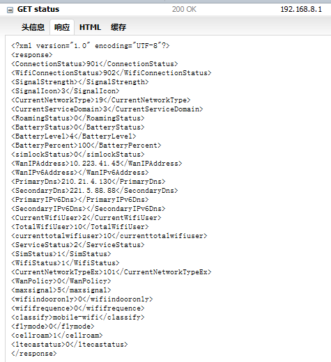  
## http://192.168.8.1/api/monitoring/traffic-statistics
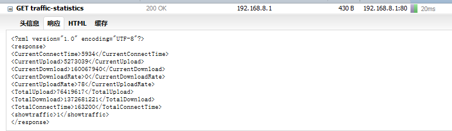
## http://192.168.8.1/api/monitoring/check-notifications
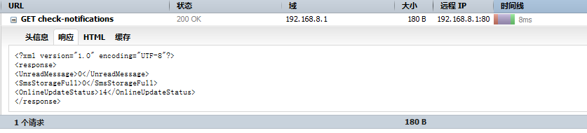  
## http://192.168.8.1/api/net/current-plmn
Firefox查看该接口返回的数据存在编码不一致出现乱码情况。360极速浏览器正常。  
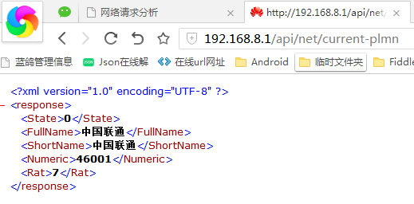  
## http://192.168.8.1/api/dialup/mobile-dataswitch
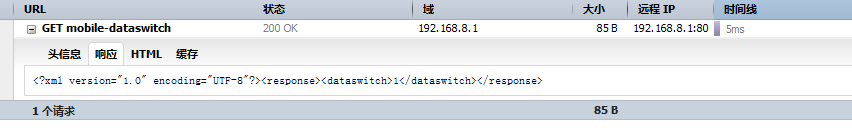  
## http://192.168.8.1/api/monitoring/converged-status
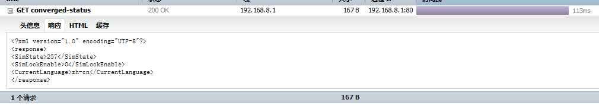  
## http://192.168.8.1/api/wlan/handover-setting
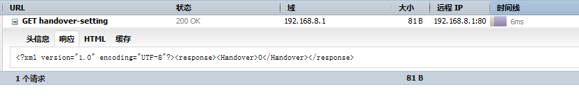  
## http://192.168.8.1/api/wlan/station-information
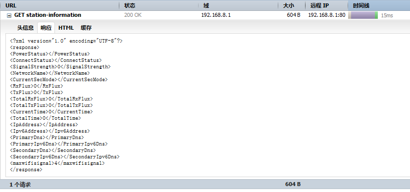  
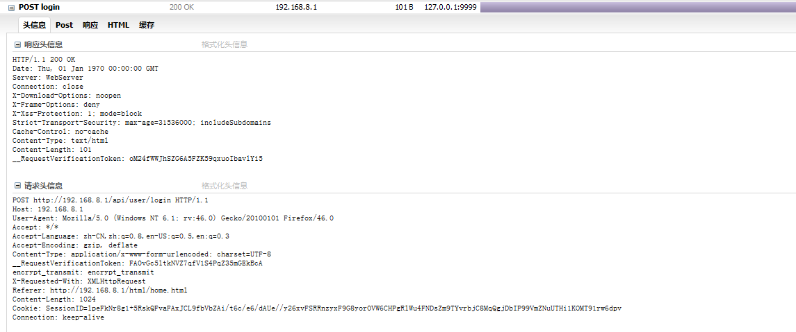  
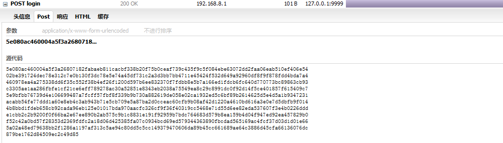  
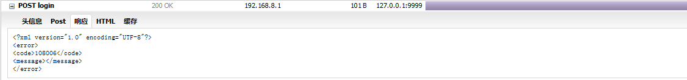  

