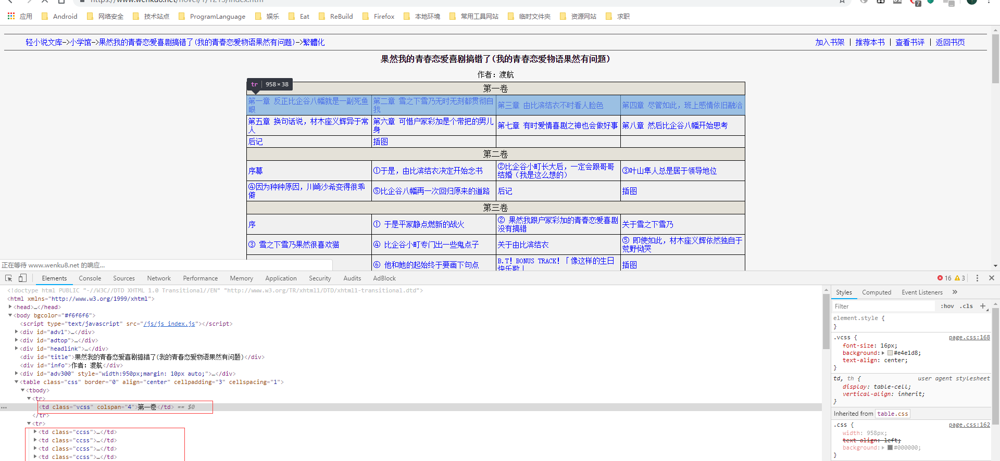
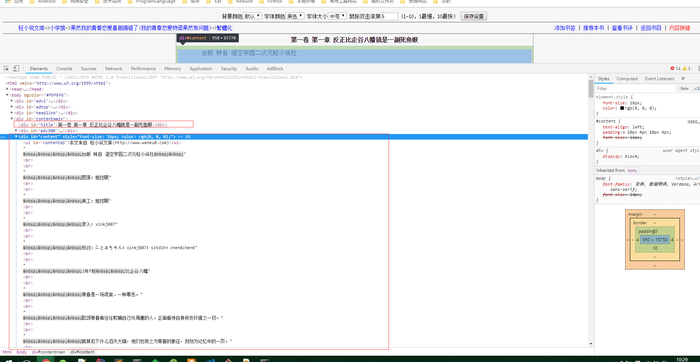
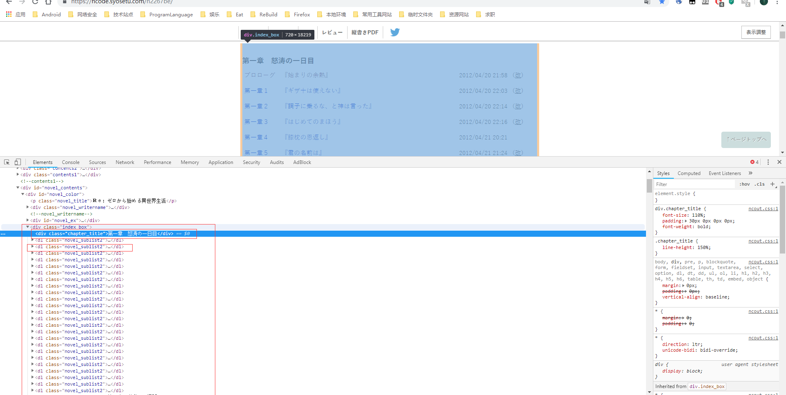
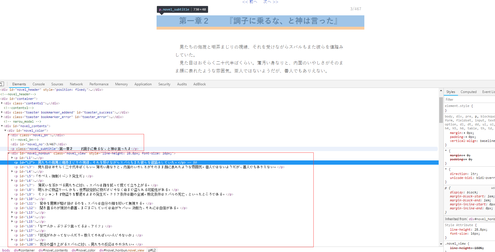

Jsoup的小说爬取实战，一般而言小说的爬取先需要爬取每个章的链接，然后根据章节的链接爬取每个章节的内容。下面以几个小说的网站为例讲解下。

由于小说基本都是分卷和章节先定义pojo类用于存储爬取的信息
```
public class NovelEntity {
    private int reelNum;
    private String reelName;
    private List<Chapter> chapterList;
    ...
    //getter and setter method
    ...
    public static class Chapter {
        private String chapterName;
        private String chapterUrl;
    }
    ....
    //getter and setter method
    .....
}
```

* https://www.wenku8.net/novel/1/1213/index.htm

该网站会封ip，爬取时注意速度不要太快，否则可能导致ip被封，同时请求时加上请求头部防止被屏蔽。

先分析索引页面以便获得所有章节链接



经分析章节链接主体位于tbody标签中，tr标签只有一个td元素时是卷名，否则就是章节名章节名中的link是相对地址，需要自己转化成绝对地址。
爬取所有章节地址的代码如下：
```
public static List<NovelEntity> getNovelContentUrl(String indexUrl) {
        Document document;
        try {
            document = Jsoup.connect(indexUrl).headers(HttpUtils.getRequestHeaders()).get();
            Element indexElement =  document.getElementsByTag("tbody").get(0);
            Elements trList =  indexElement.getElementsByTag("tr");
            List<NovelEntity> list = new ArrayList<>();
            for (int trNum = 0, reelNum = 0 ; trNum < trList.size() ; trNum++) {
                Elements tds = trList.get(trNum).getElementsByTag("td");
                if (tds.size() == 1) {
                    NovelEntity novelEntity = new NovelEntity();
                    novelEntity.setReelNum(++reelNum);
                    novelEntity.setReelName(tds.get(0).text());
                    novelEntity.setChapterList(new ArrayList<>());
                    list.add(novelEntity);
                } else {
                    for (Element chapter : tds) {
                        if (chapter.getElementsByTag("a") != null && chapter.getElementsByTag("a").size() > 0) {
                            Element content = chapter.getElementsByTag("a").get(0);
                            NovelEntity.Chapter chapter1 = new NovelEntity.Chapter();
                            chapter1.setChapterName(content.text());
                            chapter1.setChapterUrl(content.attr("href"));
                            list.get(reelNum - 1).getChapterList().add(chapter1);
                        }
                    }
                }
            }
            for (NovelEntity novelEntity : list) {
                System.out.println(novelEntity.toString());
            }
            return list;
        } catch (IOException e) {
            e.printStackTrace();
        }
        return null;
    }
```

这样就获取到了所有的章节链接。之后针对章节链接进行爬取，存储至本地文件。
以 第一章为例 https://www.wenku8.net/novel/1/1213/37500.htm
id为title的元素包含了章节名称 ,为content的包含了正文  
  
正文中需要处理两项:正文开始的和结束时网站说明；正文中的空格符(`&nbsp;`)和`<br>`标签。前者因为同一个网站每个章节的开始和结束固定考虑字符串截取。后者考虑字符串替换。

```
public static void startParseChapterContent(String targetUrl, String reelName, String baseName) {
        int startLength = START_POS, endLength = END_POS;
        String fileName = baseName + reelName + ".txt";
        Document document;
        try {
            document = Jsoup.connect(targetUrl).headers(HttpUtils.getRequestHeaders()).get();
            Element novelContent = document.getElementById("content");
            String novelWithGarbled = novelContent.toString();
            String novelTitle = document.getElementById("title").text();
            String novelText =  novelWithGarbled.substring(startLength, novelWithGarbled.length()).substring(0, (novelWithGarbled.length() - startLength - endLength)).replace("&nbsp;", "").replace("<br>", "\n");
            appendContentToFile(novelTitle + "\n\n\n" + novelText + "\n\n\n", baseName, reelName + ".txt");
        } catch (IOException e) {
            e.printStackTrace();
        }
    }
```

这样章节的正文内容就取到了，考虑到章节中插图章节，爬取时需要跳过。


* https://ncode.syosetu.com/n2267be/
再来看Re-zero日文版网站(该网站可能需要科学上网)，分析后得出的结论如下：
1. 类名为index_box的div包含了所有的卷名和章节信息
2. 类名为chapter_title的div是卷名信息，类名为novel_sublist2的dl元素包含该卷的子章节信息



这里考虑将卷名所在的div元素新增dl元素，这样通过类名筛选时就不会过滤掉卷名所在的元素。为chapter_title的div元素添加这样的子节点
```
<dl class="novel_sublist2" isReel = "true">%s</dl>
```
通过isReel判断是否是卷名。这样爬取所有章节名称的代码如下：
```
public List<NovelEntity> getNovelContentUrl(String indexUrl) {
        List<NovelEntity> novelEntityList = new ArrayList<>();
        try {
            Document document = Jsoup.connect(indexUrl).headers(HttpUtils.getRequestHeaders()).get();
            Element content =  document.getElementsByClass("index_box").get(0);
            Elements chapterList =  content.getElementsByClass("chapter_title");
            //insert new node to parse easily
            for (Element element : chapterList) {
                element.before(String.format("<dl class=\"novel_sublist2\" isReel = \"true\">%s</dl>", element.text()));
            }
            Elements sublist =  document.getElementsByClass("novel_sublist2");
            for (int i = 0, reelNum = 0, total = sublist.size(); i < total; i++) {
                Element element = sublist.get(i);
                if ("true".equalsIgnoreCase(element.attr("isReel"))) {
                    NovelEntity novelEntity = new NovelEntity();
                    novelEntity.setReelNum(reelNum++);
                    novelEntity.setReelName(element.text());
                    novelEntity.setChapterList(new ArrayList<>());
                    novelEntityList.add(novelEntity);
                    continue;
                }
                Element chapter = element.getElementsByTag("a").get(0);
                String chapterName = chapter.text();
                String chapterUrl = chapter.attr("href");
                NovelEntity.Chapter chapter1 = new NovelEntity.Chapter();
                chapter1.setChapterName(chapterName);
                chapter1.setChapterUrl(chapterUrl);
                novelEntityList.get(reelNum - 1).getChapterList().add(chapter1);
            }
            for (NovelEntity novelEntity : novelEntityList) {
                System.out.println(novelEntity.toString());
            }
            return novelEntityList;
        } catch (IOException e) {
            e.printStackTrace();
        }
        return null;
    }
```

之后是爬取章节内容，经分析类名novel_subtitle的p元素包含了章节标题，而id为novel_honbun的div中包含了小说的主体，小说主体通过p元素来进行分段，考虑直接提取text信息
  

具体的代码如下：
```
public void startParseChapterContent(String targetUrl, String reelName, String baseName) {
        try {
            Document document = Jsoup.connect(targetUrl).headers(HttpUtils.getRequestHeaders()).get();
            String chapterName = document.getElementsByClass("novel_subtitle").get(0).text();
            Elements novelWithMess = document.getElementById("novel_honbun").getElementsByTag("p");
            StringBuffer stringBuffer = new StringBuffer();
            for (int i = 0 ; i < novelWithMess.size(); i++) {
                stringBuffer.append(novelWithMess.get(i).text()).append("\n");
            }
            FileUtils.appendContentToFile(chapterName + "\n\n\n" + stringBuffer.toString() + "\n\n\n", baseName, reelName + ".txt");
        } catch (IOException e) {
            e.printStackTrace();
        }
    }
```


