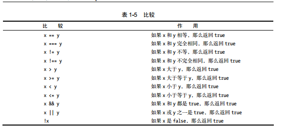

对象
属性
方法
DOM
处理事件
值和变量，变量命名规则
javascript的比较是个什么鬼？　　
　　
HTML 包含页面的内容和结构
CSS 控制页面的外观和表现
JavaScript 控制页面的行为
属性class和id
class标记出的元素可能会多次使用 用.
而id标记出的元素对于文档是唯一的 用#。
**用于标记元素**  

| 标签  | 属性 | 意义 |
|:--|:--|:--| 
| html |  | 包含网页 的html的部分 |
| head | | 包含网页的页头部分 |
| script |  | 包含网页的脚本或对外部脚本文件的引用必须包含src属性标记外部脚本所在的位置 |
| title | | 网页的标题　|
| body | | 包含网页的内容 |
| h1..h6 | | 标题 |
| a | | |
| id | | |
| table | | 在网页上显示表格数据 |
| tr | | 表格中的一行　|
| th | | 表格中列的标题单元格，一般用于第一行来做标题显示 |
| td | |  包含表格的每个单元格 |
| img | src,width,height,alt,id | 图像 |

函数的命名
```
function functionName() {
    //do something
} 
```

`var` 声明变量  
数组

```
var newCars=new Array("To",1,"fd");
```

`newCars[2]`  

函数返回值  

```
function getNewNum(){
    return Math.floor(Math.random()*15);
}
```

# 窗口与框架
# 表单处理

| 标签 | 属性 | 意义 | 
|:--|:--|:--|
| form | | | 
| |　action | Web服务器上面处理数据服务器端的CGI的名称 |
| input | | |
| | class | 为元素分配类名 |
| | id | 为元素分配唯一的id |
| | name | 主要用于对单选按钮的分组 |
| | maxlength | 用户可以输入的最大数据长度 |
| | size | 在页面上显示的字符数量 |
| | type | 所需的输入控件的类型有效值是button，checkbox，image,password，radio，reset，submit和text |
| | value |　预先为这个表单字段设定的值 |
| label | | 用来为没有内置标签的控件制定表情，比如文本字段， |
|  | for | 将标签与特定元素的id关联起来 |
| option | | 在select标签中可用的选项 |
| | selected |　指出这个选项是否为默认选项　|
| | class | 分配给这个元素的类 |
| | id | 为这个元素分配的唯一id |
| | size | 在页面显示的选项的数量 |

# 表单和正则表达式

# 处理事件  

# JavaScript和Cookie

## tips
1. 带圆括号的函数名意味着正在调用这个函数；如果没有圆括号就是将它赋值个事件处理程序以便在此事件发生时运行它。
 ```
 window.onload=writemessage;
 function writemessage() {
    document.getElementById("hello").innerHTML + "hellow wold!";
 }
 ```

2. 