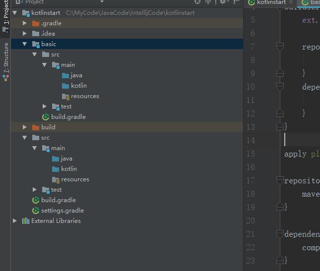
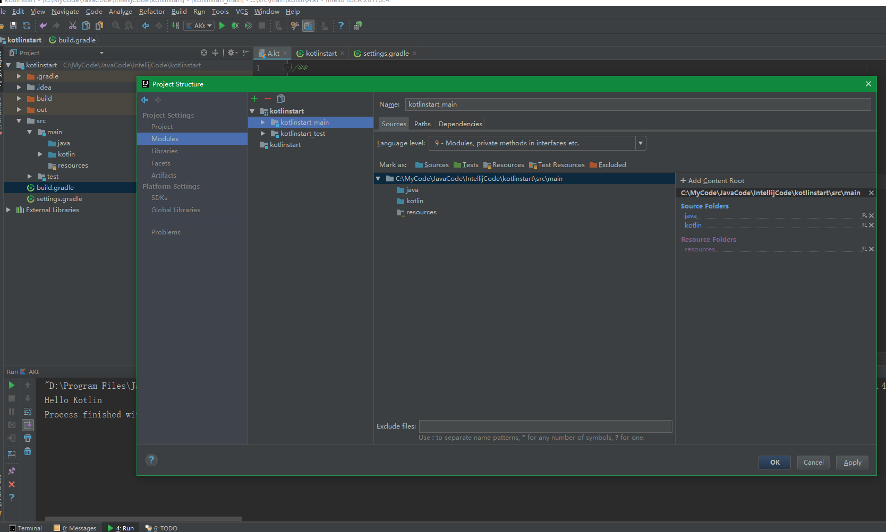

  

首次创建Kotlin项目会下载一些依赖，网速不行的话很耗时间这时如果停止了项目之后在打开后续即便同步成功了也会导致src目录不能正常创建，需要自己手工创建，或者删掉该项目重建，这时由于Gradle已经全部同步好了依赖会正常执行创建src的目录流程，最后的效果如下图：
  


```
Configure project :discuz.crawler
The DefaultSourceDirectorySet constructor has been deprecated. This is scheduled to be removed in Gradle 6.0. Please use the ObjectFactory service to create instances of SourceDirectorySet instead.
    at build_3flr4mgh71tt8bp5n562qqixo.run(C:\MyCode\JavaCode\IntellijCode\javamix\discuz.crawler\build.gradle:15)
    (Run with --stacktrace to get the full stack trace of this deprecation warning.)
```

实际中的 build.gradle 中没有用到任何和 sourceSet 相关的东西，经查询 stackoverflow 上的解释是 kotlin Gradle plugin 的问题，最新版已经修复了该问题

https://stackoverflow.com/questions/53461821/the-defaultsourcedirectoryset-constructor-has-been-deprecated-how-to-use-the-ob