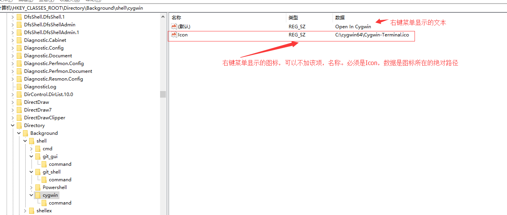
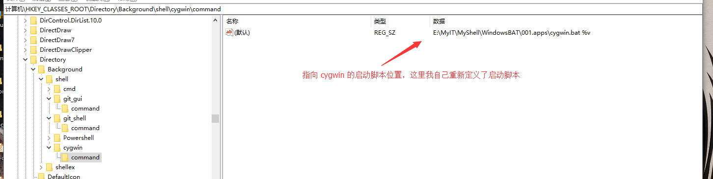
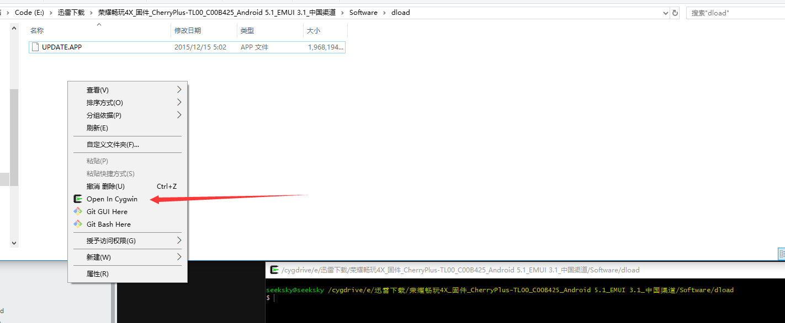

[TOC]

>  udpate 2019/09/29

# 前言

Windows 办公总有一些重复性的工作可以简化，有些工作总有更方便快捷的实现方式，这里记录下批处理脚本以及可能混合注册表的使用。

# 选择分支
```
set /p isChange=1.已调整为自己模块 2.未调整
if "%isChange%"=="1" goto :startscript
if "%isChange%"=="2" goto :ScriptExit
:startscript
 echo Hello 你选择了1
:ScriptExit
  echo 你选择了退出
  exit /B
```

# 判断文件夹是否存在无则创建

```
if exist %outPutFilePath% (
		  rem dosomething
		) else (
		   rem dosomething
		)
```
# 打开指定的文件夹
```
@echo off
cd /d "C:\Program Files\feiq\AutoRecv Files\" && start . && exit
```

# 获取年月日时分秒
```
set "year=%date:~,4%"
set "month=%date:~5,2%"
set "day=%date:~8,2%"
set "hour=%time:~0,2%"
set "minute=%time:~3,2%"
set "second=%time:~6,2%"
rem "定义输出日志需要的变量"
rem "处理10点之前之后的情况"
set timevar=%time:~0,2%
if /i %timevar% LSS 10 (
set timevar=0%time:~1,1%
)
set timevar=%timevar%%time:~3,2%%time:~6,2%
```


# 获取所有磁盘

```
@echo off  
set str=c d e f g h i j k l m n o p q r s t u v w x y z  
echo  当前硬盘的分区有：  
for %%i in (%str%) do if exist %%i: echo %%i:  
pause

```

# 删除SVN和Git相关文件及文件夹
将下面代码保存为clearnSVNGIT.reg,双击运行，之后在右键中便可以找到清除git和svn的功能选项了
```
Windows Registry Editor Version 5.00  
[HKEY_LOCAL_MACHINE\SOFTWARE\Classes\Folder\shell\DeleteSVN]  
@="Delete SVN & Git Folders"  
[HKEY_LOCAL_MACHINE\SOFTWARE\Classes\Folder\shell\DeleteSVN\command]
@="cmd.exe /c \"TITLE Removing SVNGIT Folders in %1 && COLOR 02 &&
FOR /r \"%1\" %%f IN (.svn,.git) DO IF EXIST \"%%f\" RD /s /q \"%%f\" &
FOR /r \"%1\" %%f IN (.gitignore) DO IF EXIST \"%%f\" DEL \"%%f\" \""
```

# 创建年月日文件夹
```
@echo off
echo "正在创建以日期为名的文件夹"
set "year=%date:~,4%"
set "month=%date:~5,2%"
set "day=%date:~8,2%"
mkdir "C:\Users\Administrator\Desktop\%year%%month%%day%"
echo "创建完成"
cd /d  "C:\Users\Administrator\Desktop\%year%%month%%day%" && start .
```

# 截屏并将图片提取至pc
```
@echo off
set "year=%date:~,4%"
set "month=%date:~5,2%"
set "day=%date:~8,2%"
set "hour=%time:~0,2%"
set "minute=%time:~3,2%"
set "second=%time:~6,2%"
mkdir "C:\Users\Administrator\Desktop\%year%%month%%day%"
echo "创建完成"
cd /d "C:\Users\Administrator\Desktop\%year%%month%%day%"
mkdir screencap
cd screencap
adb shell mkdir /mnt/sdcard/screencap
echo "开始截屏"
adb shell screencap -p /sdcard/screencap/%year%%month%%day%%hour%%minute%%second%.png
adb pull /mnt/sdcard/screencap/ .
adb shell rm -rf /mnt/sdcard/screencap
start .
```

# 启动应用程序
```
@echo off
echo "start Atom,waitting!!!"
cd /d "C:\Users\Administrator\AppData\Local\atom\app-1.11.1"
atom.exe
```


# 右键添加 Open in Cygwin 菜单

流程上：先注册表添加右键菜单选项；cygwin切换至开启菜单的位置

* 右键添加菜单需要修改注册表  
在 `\HKEY_CLASSES_ROOT\Directory\Background\shell` 新增项 cygwin

  

cygwin 下新建项 `command`, 设置数据为启动 cygwin 的脚本所在的位置

  

实现的注册表脚本 cygwin.reg 如下：

```
Windows Registry Editor Version 5.00

[HKEY_CLASSES_ROOT\Directory\Background\shell\cygwin]
@="Open In Cygwin"
"Icon"="C:\\cygwin64\\Cygwin-Terminal.ico"

[HKEY_CLASSES_ROOT\Directory\Background\shell\cygwin\command]
@="E:\\MyIT\\MyShell\\WindowsBAT\\001.apps\\cygwin.bat %v"
```

保存文件为 cygwin.reg 双击合并至注册表即可。

* 修改启动脚本

启动 cygwin 的脚本 `cygwin.bat` 的内容如下：

```
@echo off
cd /d C:\cygwin64\bin\
set script_exec_path=%*
mintty.exe -i /Cygwin-Terminal.ico - | taskkill /f /im cmd.exe
```

> 新建 script_exec_path 变量用于存储右键时传递进来的路径

* 修改 cygwin 的配置文件

最后需要修改 cygwin 的 `.bash_profile`，来完成切换 cygwin 终端中的路径。

在 `.bash_profile` 最后一行添加 `cd "${script_exec_path}"`

最终的效果如下：  
  

* 琐碎  

本来以为还需要调用 cygwin 提供的 cygpath.exe 将 Windows 路径和 Cygwin 的路径转化一下的结果发现 mintty.exe 内部似乎已经转化过路径，就没做处理。  

其实是尝试处理发现没成功，批处理里调用 cygpath.exe 作为参数没成功，直接退出脚本了不知道什么情况.

# 右键菜单添加 dos2unix,unix2dos

注册表添加选项

`\HKEY_CLASSES_ROOT\*\shell` 为文件添加菜单

```
Windows Registry Editor Version 5.00

[HKEY_CLASSES_ROOT\*\shell\dos2unix]
@="dos2unix"

[HKEY_CLASSES_ROOT\*\shell\dos2unix\command]
@="E:\\MyIT\\MyShell\\WindowsBAT\\005.FileOpen\\rightMenuDos2Unix.bat %1"
```

rightMenuDos2Unix.bat 脚本内容：

```
@echo off
set exec_path=%1
echo exec_path is %exec_path%
rem 注册表只添加文件，所以不用管文件夹的情况
for /F "tokens=1,2 delims=." %%a in ('dir /b %exec_path%') do (set fileName=%%a)
for /F "tokens=1,2 delims=." %%a in ('dir /b %exec_path%') do (set fileSuffix=%%b)
echo 文件名:%fileName%  文件后缀:%fileSuffix%


rem if "%fileSuffix%" == "" (echo 无后缀)
rem if "%fileSuffix%" == "sh" (echo 后缀为sh)
rem if "%fileSuffix%" == "bash" (echo 后缀为bash)

if "%fileSuffix%" == "" (dos2unix %exec_path%)
if "%fileSuffix%" == "sh" (dos2unix %exec_path%)
if "%fileSuffix%" == "bash" (dos2unix %exec_path%)
```

脚本并不考虑文件夹情况，因为右键菜单只有文件时才出现。

* 琐碎

fuck，写的差不多了才发现写的 Linux Shell 脚本，然后注册表那样执行不了 Shell 脚本只能换成批处理，重新写一遍。

批处理主要是路径的提取，和文件后缀的处理。最后也是搜索了半天选择自己想，按照自己的想法实现，关于判断是否是文件夹，可以考虑管道重定向输入至文件，如果该文件存在那就是目录否则就是文件。

# 结束当前批处理进程

关闭当前 BAT 脚本，功能可以说是很常见了，比如上面的Apps快速启动脚本，启动Apps后需要关闭脚本开启的终端。

* 解决方案  

设置终端的标题；根据标题结束进程

```
@echo off
set title_flag=%time%
title %title_flag%

taskkill /FI " WINDOWTITLE eq %title_flag% " /F
```


* 吐槽  

从第一次写 Apps 的快捷启动脚本就想实现这个功能只是当时一直没有找到好的解决方案
只能选择  `| taskkill /f /im cmd.exe` 然后导致了误伤其他 cmd.exe 进程。

今天写的时候就想着只能从 PID 下手了，然后就搜索资料。
1. 有推荐 wmic 获取 PID
2. 有 tasklist 获取 PID，开始也想着 先获取 PID 然后 taskkill 杀掉它

当时也是想着先获取 PID 然后杀掉它，巴拉巴拉巴拉一堆的流程，直到突然看到了 taskkill 的说明，看到了和 tasklist 一模一样的筛选器，最终得到了最简洁的代码

# 使用模板创建启动app脚本

CBat.bat 脚本

```
@echo off
set bat_name=%1
if "%bat_name%" == "" (
    echo 文件名为空，请输入文件名
    pause
    exit
)
set bat_file_path="%MyWindowsBatDir%\%bat_name%.bat"

echo 批处理文件存储路径 %bat_file_path%
type %MyWindowsBatDir%\template >> %bat_file_path%
set absolute_path=%~f0
title %absolute_path%
call killSource.bat %absolute_path% | notepad %bat_file_path%
```

脚本需要模板 tempate 文件配合，模板文件内容如下：

```
@echo off
set absolute_path=%~f0
title %absolute_path%

call killSource.bat %absolute_path%
```


最后新建启动app脚本，win+r 输入 `cbat name` 即可。

# 右键添加apk安装和jar快速运行菜单

```
@echo off
set absolute_path=%~f0
title %absolute_path% 
echo 右键菜单，安装apk文件或者运行 jar 文件
rem 为了避免空格的影响，注册表中的调用加了双引号也就是%1自带双引号
set exec_path=%1
echo exec_path is %exec_path%

if not exist %exec_path% (
    echo %exec_path% 文件不存在，请检查目录是否正确
    pause
    exit 3
)

rem 考虑到文件一般得情况，取后7位作为包含后缀的字符串
set first_sub=%exec_path:~-7%
rem 移除最后的双引号
set last_string=%first_sub:~0,-1%
echo 全路径后字符串后6位为 %last_string%

rem 注册表只添加文件，所以不用管文件夹的情况

rem for /F "tokens=1,2 delims=." %%a in ('type temp') do (set fileName=%%a)
for /F "tokens=1,2 delims=." %%a in ('echo %last_string%') do (set fileSuffix=%%b)

echo 文件后缀:%fileSuffix%

rem if "%fileSuffix%" == "" (echo 无后缀)
rem if "%fileSuffix%" == "sh" (echo 后缀为sh)
rem if "%fileSuffix%" == "bash" (echo 后缀为bash)

set temp_apk_file=%USERPROFILE%\android_install_temp.apk
if "%fileSuffix%" == "apk" (
    rem 实际中发现中文名的apk会安装失败，因此先拷贝apk文件至桌面并重命名为全英文名称
    echo apk文件，拷贝至临时目录，执行安装
    echo 源文件为 %exec_path%, 目录路径为 "%temp_apk_file%"
    copy /Y %exec_path% "%temp_apk_file%"
    adb install -r "%temp_apk_file%"
    del /Q "%temp_apk_file%"
    pause
    exit 4
)

if "%fileSuffix%" == "jar" (
    echo jar文件，准备运行中
    java -jar "%exec_path%"
    pause
    exit 5
)
echo 不是预期文件格式,请在apk或jar上右键执行该指令 && pause
```

保存该以上代码为 `installorexec.bat`

注册表中添加新项具体值如下:

```
Windows Registry Editor Version 5.00

[HKEY_CLASSES_ROOT\*\shell\installorexec]
@="Install Apk or Exec Jar"

[HKEY_CLASSES_ROOT\*\shell\installorexec\command]
@="E:\\MyIT\\MyShell\\WindowsBAT\\006.Registry\\installorexec.bat  \"%1\""
```

***waring*** 注意是 "%1" 而非 %1,否则路径中出现空格时会出现错误

# 定时自动备份脚本

两个脚本 `minbat.bat` 和 `BackupYDiskCode.bat` 用于计划任务

`minbat.bat` 内容如下：
```
@echo off 

echo 最小化执行自动备份脚本

cd /d "E:\MyIT\MyShell\1.WindowsBat"
start /min BackupYDiskCode.bat
```

`BackupYDiskCode.bat` 内容如下：

```
@echo off & setlocal enabledelayedexpansion
echo 正在备份内存映射盘的文件
echo 排除 build/,.idea 等目录

set runPath=%CD%
set sourePath=Y:\MyCode\AndroidCode\BDD
set targetDir=E:\MyIT\MyCode\Backup\AndroidCode\AutoBackups\
set targetPath=%targetDir%
set logFileDir=E:\MyIT\MyCode\Backup\log


if not exist %logFileDir% (
  mkdir %logFileDir%
)
rem 定义时间戳 用于写入日志文件
set "year=%date:~,4%"
set "month=%date:~5,2%"
set "day=%date:~8,2%"
set "hour=%time:~0,2%"
set "minute=%time:~3,2%"
set "second=%time:~6,2%"
rem "定义输出日志需要的变量"
rem "处理10点之前之后的情况"
set timevar=%time:~0,2%
if /i %timevar% LSS 10 (
set timevar=0%time:~1,1%
)

set currentHour=%time:~0,2%
set /a cmpHour=%currentHour%-2
set fileTimeStamp=%year%-%month%-%day%_%timevar%\%time:~3,2%
set timevar=%timevar%:%time:~3,2%:%time:~6,2%
set timestamp=%year%-%month%-%day%_%timevar%


set logFilePath=%logFileDir%\%year%_%month%_%day%.txt

echo %timestamp%
echo %timestamp% 备份内存盘代码文件 >> %logFilePath%

echo build\ > %TEMP%\autobackup_exclude.txt
echo .idea\ >> %TEMP%\autobackup_exclude.txt
echo .gradle\ >> %TEMP%\autobackup_exclude.txt
echo .git\ >> %TEMP%\autobackup_exclude.txt

set targetPath=%targetPath%\%fileTimeStamp%\
if not exist %targetPath% (
  mkdir %targetPath%
)
echo targetPath=%targetPath%
xcopy %sourePath% %targetPath% /E /H /Y /F  /exclude:%TEMP%\autobackup_exclude.txt
cd /d %targetDir%
rem start .
echo 清理工作，清理两小时之前的备份冗余
set /a cmp=%time:~0,2%-2
dir /b /O:D %targetDir% > %TEMP%\autobackupbatconfig.txt

rem for循环中的变量直接set是不行的需要特殊处理

for /f %%i in (%TEMP%\autobackupbatconfig.txt) do (
	rem echo i=%%i targetDir=%targetDir%
	set name=%%i
	rem echo name=!name!
	set h=!name:~-2,2!
	rem echo h=!h!
	if !h! lss %cmpHour% RD /S /Q %targetDir%%%i
)
cd /d %runPath%
exit
```

脚本准备好后在，计划任何中新建任务 以最高权限执行