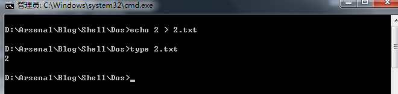
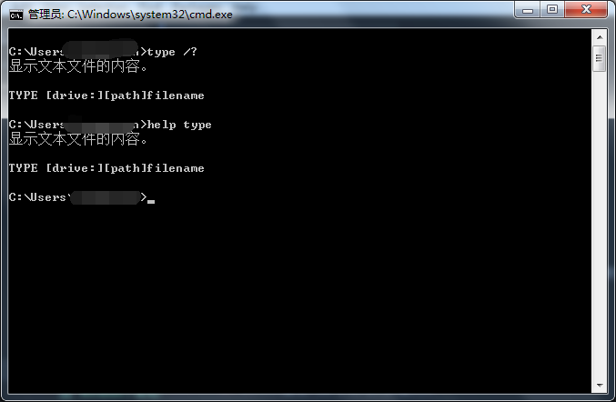
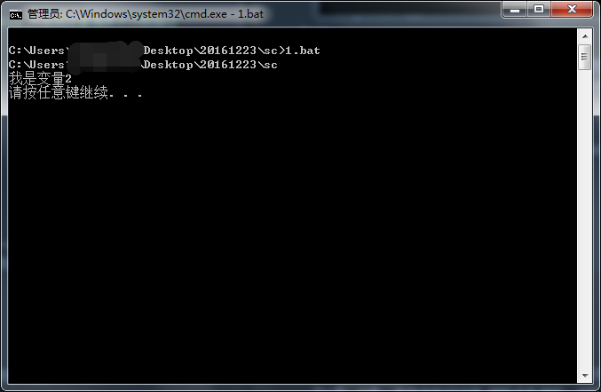
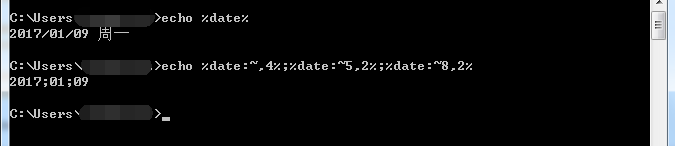
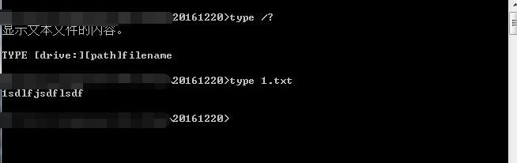
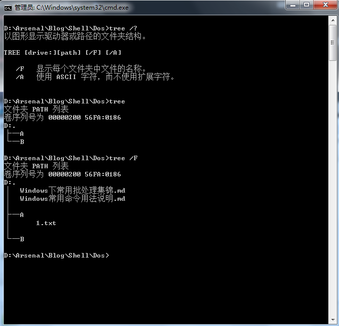

[TOC]

>  本文只对CMD命令的常见用法做出归纳，不做深入探讨


# 常用命令

***注意 Dos 环境下的编码，UTF-8 的中文在 Dos 下会显示乱码***  

## 批处理的注释
注释不会被执行，只为了提高批处理脚本的可读性。常见的注释方式有以下三种：

1. rem  

表示单行注释。例子如下  

```
rem 我是注释
```

2. goto label  

表示段注释，label名称随意。goto的含义跳转label处的代码开始执行。例子如下:

```
goto start
	@脚本声明
	@2016/12/5
:start
```

3. echo  

可做单行注释且会回显，常作提示语表示进度

```
echo "同步新增或者修改的文件"
```

## 基本命令

1. echo  
显示信息或者设置命令的回显  
  
* 显示信息  
```
echo  我是echo的显示信息
```

* 设置命令是否回显 

on:显示执行的命令 off: 不回显直接执行命令

```
@echo off
cd /d E:
```

3. echo和重定向命令常用来新建文件  



2. 查看命令帮助 一般格式 `命令command /?` 或者 `help 命令command`.  



2. set

用于显示，设置或删除环境变量，注意在Dos中设置的环境变量只适用于该窗口和该窗口的子窗口。一般用于定义批处理脚本中的变量。例如：

```
  @echo off
rem 定义一个名为CurrentPath的变量 %CD% 为系统变量值表示当前路径
set CurrentPath=%CD%
rem 回显变量CurrentPath的值
echo %CurrentPath%
set V2=我是变量2
echo %V2%
pause
```


效果如图：  

  

很多时候我们需要根据用户的输入决定那个分支的执行。使用`set /p` 便可完成该功能，例如:

```
set /p isUpdate=1.先更新 2.先不更新
if "%isUpdate%"=="2" goto :startdeal
if "%isUpdate%"=="1" goto :UpdateSVN
:UpdateSVN
```
 
3. setlocal
4. if
  一般用于判断目录是否存在，两值是否相等以及判断上一条命令的执行状态。
  `if [not] errorlevel number command`  
  `if [not] string1==string2 command`  
  `if [not] exist filename command`
5. for  
 `for`命令用于循环，用的地方很多，用处极大。常用于从文件列表读取参数，分割字符串，循环执行命令等等。

 ```
 @echo off
set exec_path=%1
echo exec_path is %exec_path%
rem 注册表只添加文件，所以不用管文件夹的情况
for /F "tokens=1,2 delims=." %%a in ('dir /b %exec_path%') do (set fileName=%%a)
for /F "tokens=1,2 delims=." %%a in ('dir /b %exec_path%') do (set fileSuffix=%%b)
echo 文件名:%fileName%  文件后缀:%fileSuffix%


rem if "%fileSuffix%" == "" (echo 无后缀)
rem if "%fileSuffix%" == "sh" (echo 后缀为sh)
rem if "%fileSuffix%" == "bash" (echo 后缀为bash)

rem if "%fileSuffix%" == "" (dos2unix %exec_path%)
rem if "%fileSuffix%" == "sh" (dos2unix %exec_path%)
rem if "%fileSuffix%" == "bash" (dos2unix %exec_path%)

if "%fileSuffix%" == "sh" (
  echo AAAAA
  echo BBBB
  dir /b C:\
)

pause

 ```

> https://www.jb51.net/article/134025.htm
> https://www.cnblogs.com/zndxall/p/9188300.html

6. start  
启动一个新窗口执行程序或者命令。个人一般用来启动资源管理器直接打开C盘，D盘。常用参数的话就 `MIN`或者`MAX`。如打开资源管理器定位到C盘：
  `start C:\`。

7. cls  
清除屏幕，用于去除屏幕的冗余信息。
8. exit  
用于退出程序。加上`/B` 表示只退出当前批处理脚本不退出cmd.exe。常用在批处理中退出程序
9. more  
逐屏显示输出。个人基本只用于一屏一屏的查看命令帮助
10. 管道命令重定向 `>>`,`>`
11. pause  
暂停批处理，显示*按任意键继续。。。* 。一般做等待显示结果或者提示用户的作用。

## 时间日期命令time,date
1. time
2. date，显示日期。常用于年月日的提取。  


## 文件及目录操作管理
1. type  显示文本内容  


2. mkdir md
3. rmdir rd
4. copy xcopy
5. cd chdir
6. dir
7. del erase
8. ren rename
9. move
10. tree 图像显示文件目录结构 常用参数/F  



## 搜索
1. find。在文件或者输出流中搜索关键字。用法简单。
2. findstr  ，`find`的升级版功能得到了很大的扩展。
 常用用法`findstr /s /c:"关键字" 要搜索的文件`，注意Dos环境下的编码问题。

## 任务管理
1. tasklist，列出当前进程列表。
2. taskkill ，杀死进程，很有必要在管理员权限模式下执行这条命令，否则一般为执行失败权限不足。常用格式`taskkill /f /im name.exe`,比如说杀死QQ进程`taskkill /f /im QQ.exe`，也可以选择使用进程的pid来杀死应用。但鉴于pid的每次开机后的不一致性不建议在脚本里面通过进程pid来杀死应用。

## 批处理的参数

## 其他乱七八糟的东西

# 常见变量声明

当前用户目录   `%USERPROFILE%`  
当前目录字符串 `%CD%`  
当前日期 `%DATE%`   
当前时间 `%TIME%`  
  

%HOMEDRIVE%%HOMEPATH%

%windir%\system32\cmd.exe

# 路径

批处理中 `%0` 代表批处理本身，`%1-%9` 代表输入的参数

```
%~0： 取文件名（名+扩展名）
%~f0：取全路径
%~d0：取驱动器名
%~p0：只取路径（不包驱动器）
%~n0：只取文件名
%~x0：只取文件扩展名
%~s0：取缩写全路径名
%~a0：取文件属性
%~t0：取文件创建时间
%~z0：取文件大小
```

# 字符串处理

https://www.jb51.net/article/52744.htm  
https://zhuanlan.zhihu.com/p/36137294

set var=abcdefghijk
%var:~a,b%

a 代表字符串截取的开始位置，默认为0可省略
b 为正数是指的从开始位置


# 注册表


命令，reg，tasklist,taskkill,mkdir,copy,xcopy,findstr,find,start,