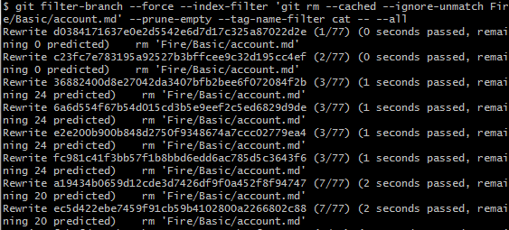
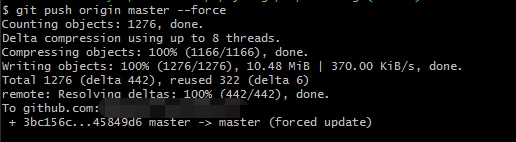
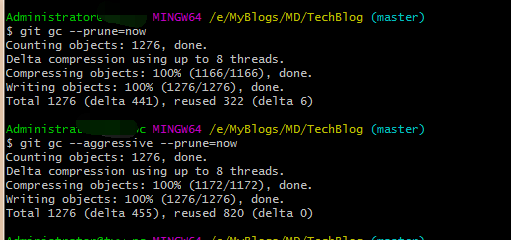
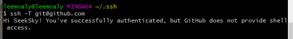
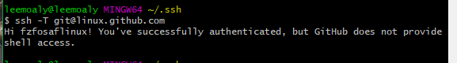
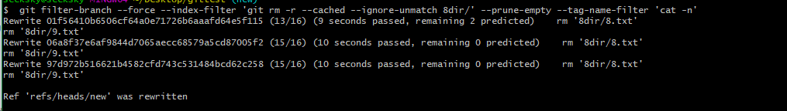
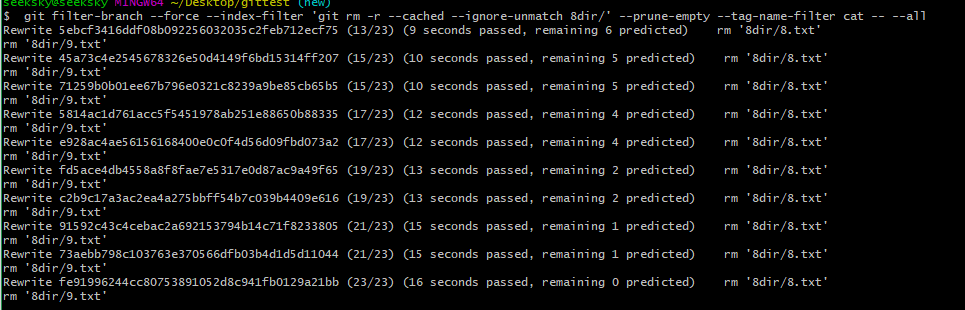

[TOC]

# 设置提交的用户名和邮箱
用户名和邮箱分全局和局部的。
设定全局的用户名和密码

```
git config --global user.name yourname
git config --global user.email youemailaddress
```

单独为某个项目重新设定用户名和邮箱地址

```
git config user.name yourname
git config user.email youremailaddress
```

查看当前git的配置`git config --list`

`git config --list` 查看时实际是该仓库下的 `.git`文件夹下的 .config 文件，直接操作该文件可以达到同样的效果，不过 `.git` 文件夹是隐藏文件，设置为可见之后方可正常操作。

# 不再跟踪某个文件

当某个文件已经被跟踪后，即使把该文件加入忽略文件清单.gitnore文件也不会起作用，此时需要让git不在跟踪该文件，因为.gitnore忽略的是未被跟踪的文件。通过 `rm`命令可以达到该效果

`git rm -r --cached xxx`, xxx是不再需要跟踪的文件或者目录

# 永久删除某文件并不再跟踪并推送至服务器。

1. 移除本地文件并不在跟踪

```
git filter-branch --force --index-filter 'git rm --cached --ignore-unmatch Fire/Basic/account.md' --prune-empty --tag-name-filter cat -- --all
```

`Fire/Basic/account.md`是要移除的文件路径  


2. 强行推送至服务器

```
git push origin master --force
```
  
  

3. 清除回收空间
    1. `rm -rf .git/refs/original/`
    2. `git reflog expire --expire=now --all`
    3. `git gc --prune=now`
    4. `git gc --aggressive --prune=now`



4. 参考链接
    1. [Git如何永久删除文件(包括历史记录)](https://www.cnblogs.com/shines77/p/3460274.html)

# 本地强制更新

```
git fetch --all
git reset --hard origin/master
git pull
```


# 多用户使用ssh。

1. 生成新账号的公钥和私钥
打开Git Bash。输入

```
ssh-keygen -f filename  -t rsa -C "youremailaddress"
```

`filename` 是指定生成的公钥私钥的文件名称.  
没有`-f`参数且没有手动输入文件名是默认以`id_rsa`和`id_rsa_pub`作为私钥和公钥名。如果存在该文件将提示是否覆盖。  
`youremailaddress`为你在Github账号的邮箱地址之后将生成的公钥文件添加至Github上面。

> 顺带说下ssh-keygen命令的用法。  
> ssh-keygen命令用于为"ssh"生成管理和转换认证密钥，支持RSA和DSA两种认证密钥  
> -b：指定密钥长度；   
> -e：读取openssh的私钥或者公钥文件；   
> -C：添加注释；   
> -f：指定用来保存密钥的文件名；   
> -i：读取未加密的ssh-v2兼容的私钥
> 公钥文件，然后在标准输出设备上显示openssh兼容的私钥/公钥；   
> -l：显示公钥文件的指纹数据；   
> -N：提供一个新密语；   
> -P：提供（旧）密语；  
> -q：静默模式；   
> -t：指定要创建的密钥类型

2. 修改配置文件

找到 `~/.ssh` 下面的 `config` 文件，如果没有就创建该文件，贴入以下内容。

```
    Host github.com  
        HostName github.com  
        PreferredAuthentications publickey  
        IdentityFile ~/.ssh/id_rsa  
      
    Host linux.github.com  
        HostName github.com  
        PreferredAuthentications publickey  
        IdentityFile ~/.ssh/my  
```

将 `Host my.github.com` 修改为你想要的别名，`IdentityFile ~/.ssh/my`修改为你新生成的私钥地址。

3. 测试配置是否正常

`ssh -T git@github.com` 测试主账号是否连接正常  


`ssh -T git@linux.github.com`  


4. 后期使用
当需要使用第二账号克隆仓库是使用如下命令

`git clone git@linux.github.com:username/repo.git `

如果该仓库是用第一账��克隆下来则需要修改远程地址方可正常推送至第二账号对应的远程仓库.命令行修改远程地址为

`git config remote.origin.url git@linux.github.com:username/repo.git`  

> 即将原来的`git@github.com`替换成`git@linux.github.com`

也可以直接修改隐藏文件夹`.git`下面的`config`文件，之后便可以使用后

`git pull origin master` 和 `git push origin master` 两条命令正常拉取推送了。


# git fatal: refusing to merge unrelated histories

关联远程仓库失败，两种方法一种是加上 `--allow-unrelated-histories`,即执行 `git pull origin master --allow-unrelated-histories`命令或者在龟壳Git中执行Fetch-Rebase操作自己本地重建。


# Github不计算Contribution。

设置错了邮箱地址一直提交代码后面才发现一直没有被计算Contribution，搜索了下发现Github是以提交邮箱作为贡献计算标准之一而自己只是随便设置了个邮箱地址要想原来提交的内容也能获取到Contribution根据Github的官方资料只能重新重写整个提交历史了。

1. 不用说肯定是先将仓库的提交信息改成正确的用户名和邮箱地址。
2. 新建个临时目录克隆仓库`git clone --bare git@github.com:xxx/xxx.git `
3. 复制下面的代码保存在新拉取的仓库文件夹下，保存文件名为rewrite.sh.

```
#!/bin/sh
git filter-branch --env-filter '
OLD_EMAIL=""
CORRECT_NAME="正确的用户名"
CORRECT_EMAIL="newemailaddress"
if [ "$GIT_COMMITTER_EMAIL" = "$OLD_EMAIL" ]
then
    export GIT_COMMITTER_NAME="$CORRECT_NAME"
    export GIT_COMMITTER_EMAIL="$CORRECT_EMAIL"
fi
if [ "$GIT_AUTHOR_EMAIL" = "$OLD_EMAIL" ]
then
    export GIT_AUTHOR_NAME="$CORRECT_NAME"
    export GIT_AUTHOR_EMAIL="$CORRECT_EMAIL"
fi
' --tag-name-filter cat -- --branches --tags
```

4. 运行脚本`./rewrite.sh`,之后会看到一堆rewrite的提示，执行完成后`git log`确认下提交历史已经更正过来了

5. 推送至远程仓库`git push --force --tags origin 'refs/heads/*'`,删除掉临时克隆下来的仓库。

## 参考资料
1. [Github官方帮助资料](https://help.github.com/articles/changing-author-info/)
1. [关于github Contributions Calendar的问题？](https://www.zhihu.com/question/21371544)
2. [为什么 Github Contributions 每一天都显示绿色？](https://segmentfault.com/q/1010000000756736)
3. [为什么Github没有记录你的Contributions](https://segmentfault.com/a/1190000004318632)

# 如何一次性输出所有日志不分页。
`git --no-pager log`

## 参考资料
1. [Git log output to XML, JSON, or YAML](https://stackoverflow.com/questions/4600445/git-log-output-to-xml-json-or-yaml)
2. [git log 日志大多时怎么不出现交互界面，直接输出全部日志](https://segmentfault.com/q/1010000007977721)


# 分支管理
1. 克隆一个远程仓库后查看远程仓库的所有分支`git branch -a`
2. 删除本地的分支`git branch -D branchName`

# 命令行提交多行注释
主要需要单引号的帮助，另外windows下需要使用git bash 而不是git cmd
```
git commit -m '
我是多行注释内容，
我是多行注释内容2 
'
```

# 合并某个提交
`git cherry-pick` 用于提交某个commit常见的情况是把某个分支上面添加的新功能相关的commit，依次添加到另外一个分支，为新分支添加原分支具有的功能。操作上如下

1. 在原分支记录下commit的id值，`git log`即可查看到
2. 切换至新分支`git checkout xxx-branchname` ，执行`git cherry-pick commitid1 commitid2 commitid3`,按原有的commit顺序依次执行
3. 有冲突就解决冲突，没冲突就可以测试验证下

>> 最好能保证工作区的clean，再执行git cherry-pick 命令


git stash 
git stash pop

git fetch 只会拉去更新不会merge

pull 的完整用法
`git pull [options] [<repository>[<refspec>]]`

* `git log ` 不分页显示
`git --no-pager log`

* 查看某次commit的文件的变动

```
git show commitId
或者
git diff commitId~
```

* 查看某个文件的修改历史

```
git log --pretty=oneline 文件名 //获取commit id
git show commitid
```

* 多用户配置
生成ssh私钥。先切换至`~/.ssh`目录，没有`.ssh`目录就新建

```
`ssh-keygen -t rsa -C "youremailaddress"`
或者加上-f参数自己指定生成的文件名称
`ssh-keygen -t rsa -C "youremailaddress" -f filename` 
```

`.ssh`目录生成`id_rsa, id_rsa.pub` 文件，多用户下需要修改`~/.ssh/config`文件，如果没有该文件就创建。

```
# 配置github.com
Host github.com                 
    HostName github.com
    IdentityFile ~/.ssh/id_rsa
    PreferredAuthentications publickey
    User user1

# 配置 gitlib
Host 192.168.11.252
    HostName 192.168.11.252
    Port 29418
    IdentityFile ~/.ssh/test_id_rsa
    PreferredAuthentications publickey
    User test
```


> Host 是别名可以自定义， 搭建的gitlibHost只能用ip直接表示，不然无法pull/push，修改了hosts文件也没啥用,不知道有没有更好的解决方式
 
使用 `ssh -T git@github.com` 测试是否正常连接至github
使用`ssh -T test@192.168.11.252` 测试是否正常连接至搭建的gitlib

* `git@github.com:xxx/xx.git`
这种事ssh的验证方式，`git` 是用户名，`github.com`是主机名。例如自己搭建的gitlib上面`git remote -v`显示

```
origin  ssh://test@192.168.11.252:29418/Android.git (fetch)
origin  ssh://test@192.168.11.252:29418/Android.git (push)

```

`ssh://` 代表ssh协议
`test` 代表用户名为test的用户
`192.168.11.252` 目的主机。
在来看多用户下的`~/.ssh/config`配置文件

```
Host 192.168.11.252
    HostName 192.168.11.252
    Port 29418
    IdentityFile ~/.ssh/test_id_rsa
    PreferredAuthentications publickey
    User test
```


* git remote命令
查看管理的远程地址

```
git remote -v
```
新增远程地址

```
git remote -add name url
```

> name 指本地显示远程地址的别名  url 远程地址

修改已有的远程地址

```
git remote set-url name url
```

> name 本地对应的远程地址的别名 

删除远程地址

```
git remote rm name
```

重命名

```
git remote rename oldName newName
```


* git pull 和 git fetch
后者只会拉去最新的代码下来，但不会自动合并而前者会自动合并。直观的效果就是fetch看不到别人最新的修改而pull可以，fetch之后要想合并代码，指定merge即可。


* git push ，git pull
`git push <远程主机名> <本地分支>:<远程分支>`
`git pull <远程主机名> <远程分支>:<本地分支>`


```
Auto packing the repository in background for optimum performance.
See "git help gc" for manual housekeeping.
```

* 移除所有未被版本跟踪的文件

```
git clean -n //查看哪些文件将被移除
git clean -df //移除所有未纳入版本控制的文件
```

* 根据commit的注释信息查找commit具体信息 

```
git log --grep "keyword"    //输出该commit的具体信息
git log --author="authorname" //authorname可以只是作者名称的一部分但大小写必须匹配
# https://blog.csdn.net/ly890700/article/details/52787257
```

* git设置代理

```
git config --global http.proxy 'schema://host:port'
git config --global https.proxy 'schema://host:port'
git config --global --get http.proxy
git config --global --get https.proxy
// example to use shadowsock for global
git config --global http.proxy 'socks5://127.0.0.1:1080'
git config --global https.proxy 'socks5://127.0.0.1:1080'
git config http.proxy 'socks5:127.0.0.1:1080' //for exist single project 
git config https.proxy 'socks5:127.0.0.1:1080' // for exist single project 
```

* 查看某个commitID位于哪个分支

```
git branch --contains CommitID //在本地分支中查找
git branch -r --contains CommitID //在远程分支中查找
git branch -a --contains CommitID //本地分支远程分支均查找该ID
```

* git log

`git log ` 后面不接路径查看时当前git项目的git历史，如果接了目录则代表该目录下发生的git历史，如

```
git log dir\  表示仅和dir目录下的git历史
git log dir\filename 表示仅和filename相关的git历史
```

查看指定时间中的commit 

```
git log --since 'Aug 2 2018' --until 'Aug 3 2018'
// 完整的data可以根据log输出中的date来设定
git log --since 'Fri Aug 3 17:59:53 2018 +0800' --until 'Fri Aug 3 17:52:17 2018 +0800'
```

> --since, --after 显示指定时间之后的提交
> --until, --before 显示指定时间之前的提交


* 解决 git status 出现中文乱码

乱码的情况很多

```
"Fire/SoftwareDevelopment/Android/13.App Decompile/00. Android APK\345\217\215\347\274\226\350\257\221\346\246\202\350\247\210.md"
        "Fire/SoftwareDevelopment/Gradle/Android\344\270\255\347\232\204Gradle\351\205\215\347\275\256\345\256\236\346\210\230.md"
```

修改配置 `git config core.quotepath false`, 再次git status中文正常显示

```
 Fire/SoftwareDevelopment/Android/13.App Decompile/00. Android APK反编译概览.md
        Fire/SoftwareDevelopment/Gradle/Android中的Gradle配置实战.md

```

http://www.worldhello.net/gotgit/08-git-misc/020-git-charset.html

http://www.worldhello.net/gotgit/index.html

乱码类似

```
<E4><BF><AE><E6><94><B9><E6><96><87><E6><9C><AC><E6><96><87><E6><A1><A3>
```

```
git config --global i18n.commitencoding UTF-8
git config --global i18n.logoutputencoding UTF-8
```

2020-07-13

上述是最常见的乱码问题，以下还有

```
git config --global core.quotepath false          # 显示 status 编码 
git config --global gui.encoding utf-8            # 图形界面编码 
git config --global i18n.commit.encoding utf-8    # 处理提交信息编码 
git config --global i18n.logoutputencoding utf-8  # 输出 log 编码 
export LESSCHARSET=utf-8                          # 因为 git log 默认使用 less 分页，所以需要 bash 对 less 命令处理时使用 utf-8 编码 
gui.encoding = utf-8 #为了解决 git gui 和 gitk 中的中文乱码问题，如果发现代码中的注释显示乱码
```


https://blog.playpi.org/2019031901.html


* 子模块处理
`.git` 仓库中可以包含其他的 `.git` 项目，其他 `.git` 被称之为子模块，子模块中会添加 `.gitmodules` 的文件，该文件包含子模块的主要信息(远程地址，路径)

git submodule add <repository> <path> 添加子模块
git submodule init 初始化子模块
git submodule update 更新子模块
git submodule foreach git pull 拉取所有子模块


git checkout -t origin/branchname

* 移除中间某个commit
非merge的commit，可以通过revert来移除掉
`git revert commitID`


* 查看当前分支的父分支

`git reflog --date=local | grep <branchname>`

相关讨论 `https://stackoverflow.com/questions/2255416/how-to-determine-when-a-git-branch-was-created`

* 忽略特定文件和后续

忽略特定文件的基本有以下几种情况：

1. 文件(夹)尚未纳入Git版本管理库，也就是没有 `add` 不想追踪该文件(夹)
2. 文件(夹)已经 `add` 进Git库，现在不想再追踪该文件(夹)
3. 文件(夹)早已纳入Git管理，现在不追踪文件(夹)且删除历史记录(防止还原)

以上三种情况都需要操作 `.gitignore` 文件，将相应文件(夹)路径写入该文件。

* 情况一：直接 `.gitignore` 写入文件(夹) 的路径
* 情况二：需要先从版本库中移除文件(夹), 然后 `.gitignore` 写入路径
* 情况三：递归遍历记录移除记录，最后 `.gitignore` 写入路径

情况二借助 `git rm` 即可完成。

```
git rm --cached filepath        //只移除工作区，不删除文件
```

> --cached 只删除工作区不删除文件，一旦出现该选项即便有 -rf 也不会删除文件
> -r 是允许递归移除，针对目录
> -f 强制更新(不知道啥玩意) 测试中 `-r,-rf,-f` 都会导致文件被删除

最后将 filepath 加入 `.gitignore` 文件中

情况三需要使用 `git filter-branch ` 来完成 

```
git filter-branch --force --index-filter 'git rm --cached --ignore-unmatch filename' --prune-empty --tag-name-filter cat
```

  

如果需要复写所有分支，一般直接加上 `--all` 参数，但这里根据文档需要 `-- --all` 才行。

```
git filter-branch --force --index-filter 'git rm --cached --ignore-unmatch filename' --prune-empty --tag-name-filter cat -- --all
```

  

然后将相关文件(夹)加入 `.gitignore` 文件中，最后回收一下本地的空间

清除回收空间 

1. `rm -rf .git/refs/original/`
2. `git reflog expire --expire=now --all`
3. `git gc --prune=now`
4. `git gc --aggressive --prune=now`


# 指定 git 终端启动时的目录

git-bash.exe 借助 `--cd=<dirpath>` 就可以达到该效果

```
@echo off
title ClientWithThisTitleWillBeKill
echo "Startting Git Bash"
cd /d "C:\Program Files\Git"
"git-bash.exe" --cd=Y:\MyCode\AndroidCode\DeepCopy\ | %MyWinScriptHome%\KILLEXE.exe
```

https://superuser.com/questions/1104567/how-can-i-find-out-the-command-line-options-for-git-bash-exe


#　参考资料

https://github.com/git/git/commit/ac6b03cb4197311b055dc5f46ab10bf37c591ae6