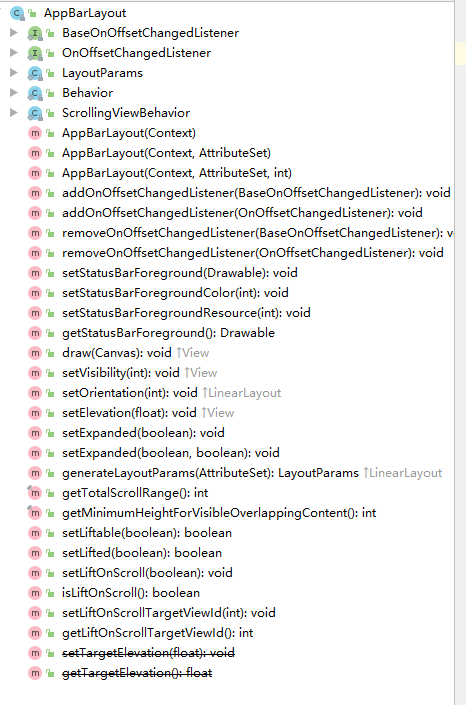

[TOC]

AppBarLayout 是 Material Desgin 中用于实现折叠效果的控件之一，实际上折叠效果需要多个控件(CoordinatorLayout,AppBarLayout)
 方可实现。

AppBarLayout 是垂直方向的线性布局实现，


  

AppBarLayout 需要作为 CoordinatorLayout 的直接子View方可正常实现功能。一段常见的 AppBarLayout 布局代码如下：

```
<?xml version="1.0" encoding="utf-8"?>
<androidx.coordinatorlayout.widget.CoordinatorLayout xmlns:android="http://schemas.android.com/apk/res/android"
    android:layout_width="match_parent"
    xmlns:app="http://schemas.android.com/apk/res-auto"
    android:layout_height="match_parent">

    <androidx.core.widget.NestedScrollView
        android:id="@+id/nsv"
        android:layout_width="match_parent"
        app:layout_behavior="@string/appbar_scrolling_view_behavior"
        android:layout_height="match_parent">
        ....
    </androidx.core.widget.NestedScrollView>

    <com.google.android.material.appbar.AppBarLayout
        android:id="@+id/appbar"
        android:layout_width="match_parent"
        android:layout_height="match_parent">
        .....
    </com.google.android.material.appbar.AppBarLayout>
</androidx.coordinatorlayout.widget.CoordinatorLayout>
```

nsv 称之为 appbar 的 scrollview(滚动视图)， AppBarLayout 要实现的折叠视图也就是 appbar 会根据 scrollview 的滑动而发生变化。

`app:layout_scrollFlags` 设置的就是 当 scrollview 滑动时 appbar 表现出来的行为，为方便叙述将手指从屏幕上方向下滑动称之为下拉，手指从屏幕下方向上称之为上拉。

注意： `app:layout_scrollFlags` 是给 appbar 的直接 childview 设置的，appbar 的非直接子view设置该属性无效

一般建议 AppLayout 里面也只有一个直接 childview 

`app:layout_scrollFlags` 的取值有：`noScroll, scroll, exitUntilCollapsed，enterAlways，enterAlwaysCollapsed, snap, snapMargins`

取值来源如下:

```
<attr name="layout_scrollFlags">
      <!-- Disable scrolling on the view. This flag should not be combined with any of the other
           scroll flags. -->
      <flag name="noScroll" value="0x0"/>

      <!-- The view will be scroll in direct relation to scroll events. This flag needs to be
           set for any of the other flags to take effect. If any sibling views
           before this one do not have this flag, then this value has no effect. -->
      <flag name="scroll" value="0x1"/>

      <!-- When exiting (scrolling off screen) the view will be scrolled until it is
           'collapsed'. The collapsed height is defined by the view's minimum height. -->
      <flag name="exitUntilCollapsed" value="0x2"/>

      <!-- When entering (scrolling on screen) the view will scroll on any downwards
           scroll event, regardless of whether the scrolling view is also scrolling. This
           is commonly referred to as the 'quick return' pattern. -->
      <flag name="enterAlways" value="0x4"/>

      <!-- An additional flag for 'enterAlways' which modifies the returning view to
           only initially scroll back to it's collapsed height. Once the scrolling view has
           reached the end of it's scroll range, the remainder of this view will be scrolled
           into view. -->
      <flag name="enterAlwaysCollapsed" value="0x8"/>

      <!-- Upon a scroll ending, if the view is only partially visible then it will be
           snapped and scrolled to it's closest edge. -->
      <flag name="snap" value="0x10"/>

      <!-- An additional flag to be used with 'snap'. If set, the view will be snapped to its
           top and bottom margins, as opposed to the edges of the view itself. -->
      <flag name="snapMargins" value="0x20"/>
    </attr>
```

`noScroll`：不滑动。即 scrollview 滑动是 appbar 无变化


`scroll`: 滑动，appbar 成为 scrollview 的一部分，跟随滑动


`exitUntilCollapsed`: 和 scroll 联用，下拉和scroll一致，上拉时先滑动appbar内容到最小高度固定在顶端不再滑动，之后滑动scrollview的内容


`enterAlways`: 和 scroll 联用，上拉和scroll表现一致，下拉时先滑动appbar再滑动scrollview


`enterAlwaysCollapsed`: enterAlways的附加属性，上拉和scroll表现一致，下拉时先appbar的childview的最小高度(如果存在)再滑动scrollview最后再滑动appbar的内容


`snap`: 和 scroll 联用，作用是当appbar只滑动了一部分的时候会自动滑动到最近的边界，效果如下图：


`snapMargins`: `snap` 的 附加属性，snap默认是滑动到appbar的childview的边界，如果需要滑动到childview的margintop和marginbottom则需要加上该属性，其实就是是否滑动到appbar的边界


```
后边者三个属性会冲突,按照当控件按照从上到下顺序分布时候,属性按照enterAlwaysClooapsed>enterAlways>exitUntilCollapsed的顺序排放不会互相冲突(两个相同的相邻也不会冲突),否则,上面的貌似会让下面的失效,上面的滚动收缩也是不太好,当拉到边界时候不时会出现拉动不灵,拉过边界漏出白边等问题
```

属性之间的优先级待验证

# 对外方法

public AppBarLayout(@NonNull Context context)

public AppBarLayout(@NonNull Context context, @Nullable AttributeSet attrs)

public AppBarLayout(@NonNull Context context, @Nullable AttributeSet attrs, int defStyleAttr)

public WindowInsetsCompat onApplyWindowInsets(View v, WindowInsetsCompat insets)

public void addOnOffsetChangedListener(@Nullable BaseOnOffsetChangedListener listener)

public void addOnOffsetChangedListener(OnOffsetChangedListener listener)

public void removeOnOffsetChangedListener(@Nullable BaseOnOffsetChangedListener listener)

public void removeOnOffsetChangedListener(OnOffsetChangedListener listener)

public void setStatusBarForeground(@Nullable Drawable drawable)

public void setStatusBarForegroundColor(@ColorInt int color)

public void setStatusBarForegroundResource(@DrawableRes int resId)

public Drawable getStatusBarForeground()

public void draw(@NonNull Canvas canvas)

public void setVisibility(int visibility)

public void setOrientation(int orientation)

public void setElevation(float elevation)

public void setExpanded(boolean expanded)

public void setExpanded(boolean expanded, boolean animate)

public LayoutParams generateLayoutParams(AttributeSet attrs)

public final int getTotalScrollRange()

public final int getMinimumHeightForVisibleOverlappingContent()

public boolean setLiftable(boolean liftable)

public boolean setLifted(boolean lifted)

public void onAnimationUpdate(@NonNull ValueAnimator valueAnimator)

public void setLiftOnScroll(boolean liftOnScroll)

public boolean isLiftOnScroll()

public void setLiftOnScrollTargetViewId(@IdRes int liftOnScrollTargetViewId)

public int getLiftOnScrollTargetViewId()

public void setTargetElevation(float elevation)

public float getTargetElevation()

public LayoutParams(Context c, AttributeSet attrs)

public LayoutParams(int width, int height)

public LayoutParams(int width, int height, float weight)

public LayoutParams(ViewGroup.LayoutParams p)

public LayoutParams(MarginLayoutParams source)

public LayoutParams(LinearLayout.LayoutParams source)

public LayoutParams(@NonNull LayoutParams source)

public void setScrollFlags(@ScrollFlags int flags)

public int getScrollFlags()

public void setScrollInterpolator(Interpolator interpolator)

public Interpolator getScrollInterpolator()

public Behavior()

public Behavior(Context context, AttributeSet attrs)

public abstract boolean canDrag(@NonNull T appBarLayout)

public BaseBehavior()

public BaseBehavior(Context context, AttributeSet attrs)

public boolean onStartNestedScroll(
        @NonNull CoordinatorLayout parent,
        @NonNull T child,
        @NonNull View directTargetChild,
        View target,
        int nestedScrollAxes,
        int type)

public void onNestedPreScroll(
        CoordinatorLayout coordinatorLayout,
        @NonNull T child,
        View target,
        int dx,
        int dy,
        int[] consumed,
        int type)

public void onNestedScroll(CoordinatorLayout coordinatorLayout, @NonNull T child, View target, int dxConsumed, int dyConsumed, int dxUnconsumed, int dyUnconsumed, int type, int[] consumed)

public void onStopNestedScroll(
        CoordinatorLayout coordinatorLayout, @NonNull T abl, View target, int type)

public void setDragCallback(@Nullable BaseDragCallback callback)

public void onAnimationUpdate(@NonNull ValueAnimator animator)

public boolean onMeasureChild(
        @NonNull CoordinatorLayout parent,
        @NonNull T child,
        int parentWidthMeasureSpec,
        int widthUsed,
        int parentHeightMeasureSpec,
        int heightUsed)

public boolean onLayoutChild(
        @NonNull CoordinatorLayout parent, @NonNull T abl, int layoutDirection)

public Parcelable onSaveInstanceState(@NonNull CoordinatorLayout parent, @NonNull T abl)

public void onRestoreInstanceState(
        @NonNull CoordinatorLayout parent, @NonNull T appBarLayout, Parcelable state)

public SavedState(@NonNull Parcel source, ClassLoader loader)

public SavedState(Parcelable superState)

public void writeToParcel(@NonNull Parcel dest, int flags)

public SavedState createFromParcel(@NonNull Parcel source, ClassLoader loader)

public SavedState createFromParcel(@NonNull Parcel source)

public SavedState[] newArray(int size)

public ScrollingViewBehavior()

public ScrollingViewBehavior(Context context, AttributeSet attrs)

public boolean layoutDependsOn(CoordinatorLayout parent, View child, View dependency)

public boolean onDependentViewChanged(
        @NonNull CoordinatorLayout parent, @NonNull View child, @NonNull View dependency)

public boolean onRequestChildRectangleOnScreen(
        @NonNull CoordinatorLayout parent,
        @NonNull View child,
        @NonNull Rect rectangle,
        boolean immediate)


# 参考资料

1. [Material Design 组件之 AppBarLayout](https://www.cnblogs.com/jzmanu/p/10284776.html)