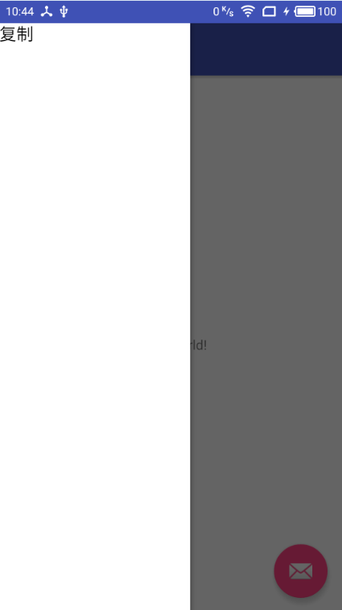

抽屉式布局最主要的控件DrawLayout。  
抽屉式导航栏是一个面板，它将应用主要的导航选项显示在屏幕的左边缘。大多数情况下它处于隐藏状态，只有当用户从屏幕左边滑动手指它才会显示出来。
  

***注意：***
 
 * 添加抽屉式布局导航栏，需要将DrawerLayout作为布局文件的根节点
 * 正常情况，DrawerLayout应该只添加两个直接的子布局，第一个子布局将作为内容的展示区，第二个子布局将作为导航
 
 Google推荐DrawerLayout和NavigationView搭配使用。

抽屉式布局基本写法。
先引入依赖(根据实际情况替换下版本号)
`compile 'com.android.support:design:25.3.0'`
需要四份文件layout文件夹下的activity_desktop_nav,include_drawer_content.xml,desktop_nav_header_content.xml以及menu文件夹下的nav_menu_content.xml，前两者对应着展示内容和抽屉布局，后两者是抽屉布局的具体内容。

1. activity_desktop_nav.xml文件如下：
```
<?xml version="1.0" encoding="utf-8"?>
<android.support.v4.widget.DrawerLayout xmlns:android="http://schemas.android.com/apk/res/android"
    xmlns:app="http://schemas.android.com/apk/res-auto"
    xmlns:tools="http://schemas.android.com/tools"
    android:layout_width="match_parent"
    android:layout_height="match_parent"
    tools:openDrawer="start">

    <include layout="@layout/include_drawer_content" />

    <android.support.design.widget.NavigationView
        android:layout_width="320dp"
        android:layout_height="match_parent"
        android:layout_gravity="start"
        app:headerLayout="@layout/desktop_nav_header_content"
        app:menu="@menu/nav_menu_content"></android.support.design.widget.NavigationView>
</android.support.v4.widget.DrawerLayout>
```
2. include_drawer_content.xml内容如下：
```
<?xml version="1.0" encoding="utf-8"?>
<LinearLayout xmlns:android="http://schemas.android.com/apk/res/android"
    android:orientation="vertical" android:layout_width="match_parent"
    android:layout_height="match_parent">
    //平常需要展示的的内容
</LinearLayout>
```
3. 抽屉布局头部内容的布局文件desktop_nav_header_content.xml的内容如下：
```
<?xml version="1.0" encoding="utf-8"?>
<LinearLayout xmlns:android="http://schemas.android.com/apk/res/android"
    android:orientation="vertical" android:layout_width="match_parent"
    android:layout_height="match_parent">
    //添加需要展示的内容，一般为imageview+TextView
</LinearLayout>
```
4.抽屉布局菜单内容文件nav_menu_content.xml的内容如下：
```
<?xml version="1.0" encoding="utf-8"?>
<menu xmlns:android="http://schemas.android.com/apk/res/android">

</menu>
```


常见的坑

1. 最常遇见的错误
`Caused by: java.lang.IllegalArgumentException: You need to use a Theme.AppCompat theme (or descendant) with the design library.`
这表明需要用到兼容主题即Theme.Appcompat，只要让app的theme或者是使用该抽屉布局的theme是Theme.AppCompat即可，需要注意的是如果eclipse转AS的项目可以存在多个style.xml文件，需要将所有style文件(不仅是主工程也包括其他的引用Android library)中的被清单文件中引用的主题均改为Theme.AppCompat，还有个坑就是运行显示抽屉式布局是正常的，但在布局编辑器界面可能无法正常预览界面，这时即便rebuild刷新布局也没有效果，可以尝试关闭重开该项目。
