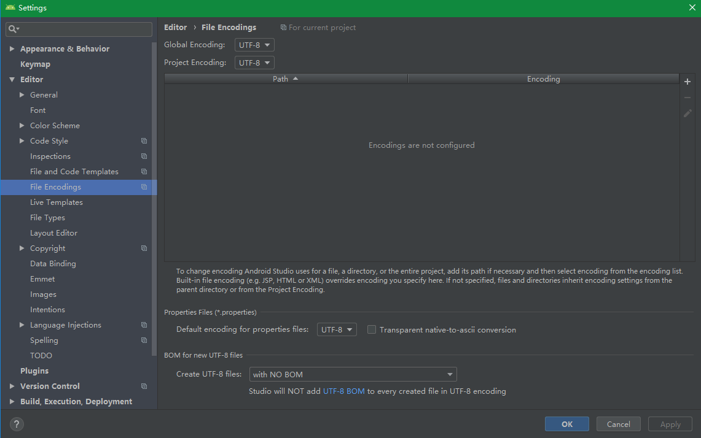
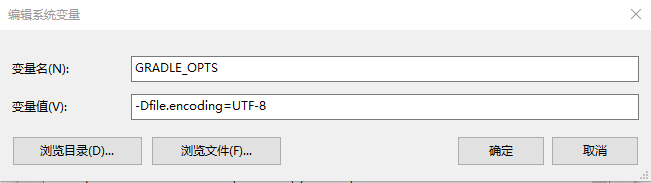
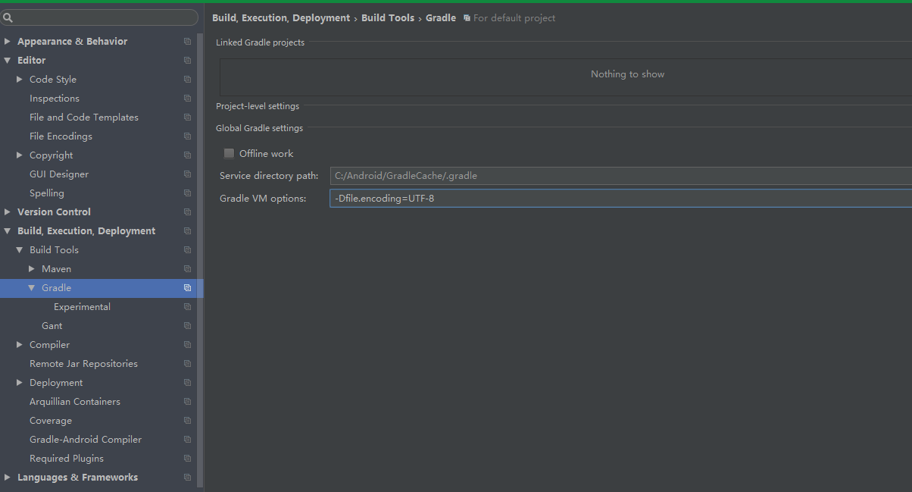

  为了编码中文乱码的出现，Android项目都提倡UTF-8编码，然而Android Studio默认是
根据当前系统来设置项目的编码格式的，Windows下是GBK，Unix下是UTF-8，因此Windows下建立的默认编码的中文项目在Unix系统上无法正常编译。

  为了避免更多编码问题的发生，先修改AndroidStudio(和IntellijIdea一样)默认编码格
式为UTF-8，File-Settings-Editor-FileEncodings,将GlobalEncoding和ProjectEncoding等全部修改为UTF-8编码，如下图所示:  
  

  Gradle 编译项目，如果依旧出现 `错误: 编码GBK的不可映射字符` 的错误提示，先检
查相应文件当前格式是否是UTF-8，不是就通过右下方转化为UTF-8，如果是UTF-8依旧有这样的提示，则代表Gradle的编译环境需要设置编码格式, 只需要保证编译时使用UTF-8即可  
1. 设置Gradle全局的编译编码为UTF-8  
新增环境变量 `GRADLE_OPTS = -Dfile.encoding=UTF-8`  
  

这样所有的Gradle项目默认以UTF-8作为编译编码格式。

2. 编译项目时加上编译格式  `gradle -Dfile.encoding=UTF-8  :projectname:build `

> 注意该编译参数临时有效

3 . AndroidStudio设置编译编码格式  
  

> 该编译参数只对AndroidStudio运行的gradle build task 有效，直接终端执行gradle build 不包含该参数

4. 项目的`build.gradle`加上编码格式  
在`build.gradle`添加如下代码:
```
tasks.withType(JavaCompile) {
    options.encoding = "UTF-8"
}
```
  
项目可以放在任意默认编译编码格式的设备下正常编译，但每个项目都需要添加如上代码t稍显繁琐.


# 参考资料

1. [Gradle 项目 编码GBK的不可映射字符](https://blog.csdn.net/qq_28195645/article/details/51453158)
2. [Gradle构建多模块项目（转）](https://www.cnblogs.com/softidea/p/4525236.html)