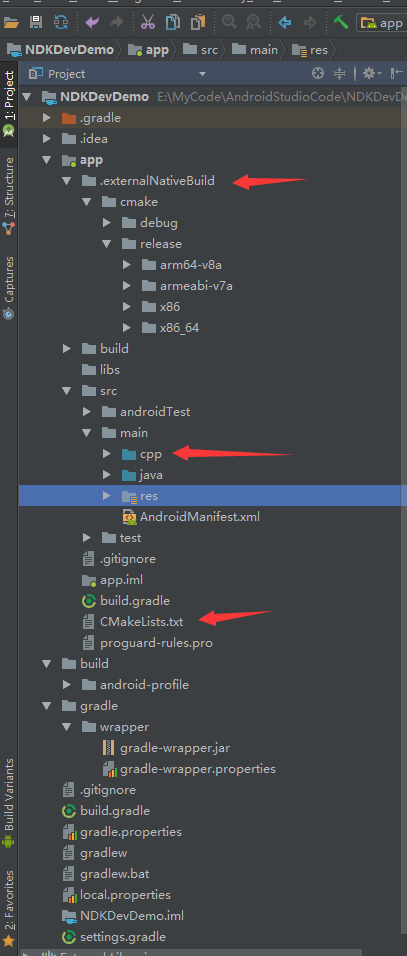

> Android Studio version:3.0.1
> NDK-bundle version 16.1.4479499

名词:
CMake
JNI
Android.mk
Application.mk

NDK(Native Development Kit)
JNI(Java Native Interface)
几个环境变量
ANDROID_HOME：指向Android SDK的platform tools目录即adb命令所在的目录
ANDROID_NDK_HOME:指向ndk-bundle的目录

jni目录和java目录同级也就是`src/main/jni`
jniLibs

从Android Studio2.2开始Google推荐使用Cmake来构建NDK项目，

暂时只说基于最新版Android Studio3.0.1的NDK开发，在新建Android项目时勾选添加C++支持，从Android Studio2.2开始ndk使用CMake来编译C代码，LLDB来调试相关代码，以上工具可以直接在SDK Manager中找到，勾选了C++支持的Android项目的结构如下:

`.externalNativeBuild`目录
`src\main\cpp`目录存储c代码类似于原先的jni目录
`CMakeLists.txt`文件说明了C代码的相关编译配置有点功能上和Android.mk和Application.mk是一致的。
使用CMake的方法不用自己去创建Android.mk和Application.mk。

# 参考资料
1. [Android NDK开发之旅(1)：Eclipse中NDK环境搭建与JNI开发流程](http://blog.csdn.net/andrexpert/article/details/72626830)
2. [Android NDK开发之旅(2)：一篇文章搞定Android Studio中使用CMake进行NDK/JNI开发](http://blog.csdn.net/AndrExpert/article/details/72904462)
3. [Android下玩JNI的新老三种姿势](http://blog.csdn.net/mabeijianxi/article/details/68525164)
4. [NDK开发 从入门到放弃(七：Android Studio 2.2 CMAKE 高效NDK开发)](http://blog.csdn.net/cuiyufeng2/article/details/64125594)
5. [NDK开发 从入门到放弃(一：基本流程入门了解)](http://blog.csdn.net/xiaoyu_93/article/details/52870395)
6. [NDK 与 JNI 的关系](http://blog.csdn.net/banketree/article/details/12167145)
7.[CMake官网](https://cmake.org/download/)