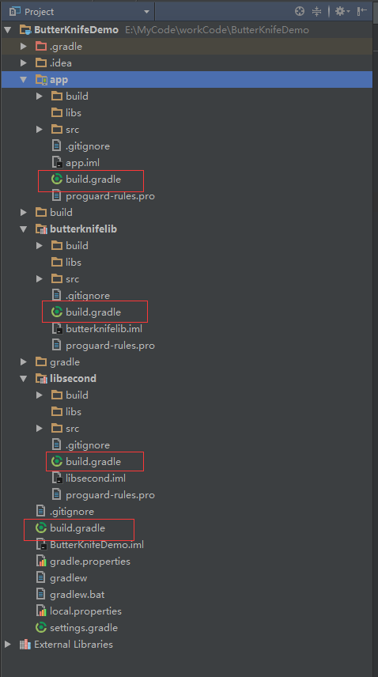
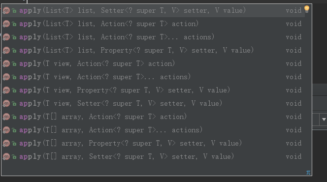
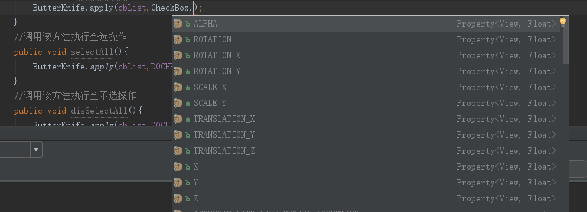
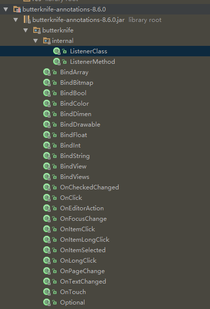
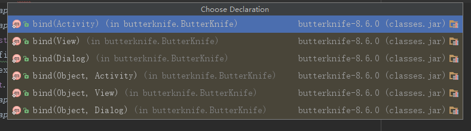
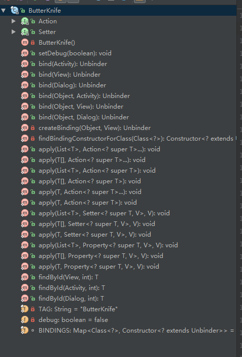

[TOC]  

>  不同版本之间使用存在差别，本文使用的ButterKnife为当前最新的8.6.0版本
>  https://github.com/JakeWharton/butterknife


# 准备工作
为了叙述方便，整个工程称之为项目，主Module称之为app。其他module统称为库(Library)。  
  
如上图，工程的build.gradle指最下方的build.gradle，app的build.gradle指图中最上层的build.gradle,中间的Build.gradle成为库的build.gradle.本说明基于Butter Knife8.6.0版本进行说明。不同版本间存在差异，具体使用说明以官方文档为准。

# 引入
**主Module中引入ButterKnife**  
在app的build.gradle的dependencies中添加如下代码：
```
    compile 'com.jakewharton:butterknife:8.6.0'
    annotationProcessor 'com.jakewharton:butterknife-compiler:8.6.0'
```
**库中使用Butter Knife**  
在库中使用ButterKnife有两步。  
第一步：先在项目的build.graldle的buildscript中添加ButterKnife插件，代码如下：
```
buildscript {
    repositories {
        jcenter()
        //为了在library中使用butterKnife添加新仓库
        mavenCentral()
    }
    dependencies {
        classpath 'com.android.tools.build:gradle:2.3.2'

        // NOTE: Do not place your application dependencies here; they belong
        // in the individual module build.gradle files
        //为了在libraries中使用ButterKnife新添加的仓库
        classpath 'com.jakewharton:butterknife-gradle-plugin:8.6.0'
    }
}
```

第二步：在需要使用到ButterKnife的库的build.gradle中添加如下代码：
在头部引入butterknife
```
apply plugin: 'com.jakewharton.butterknife'
```

同时在该库build.gradle的依赖部分添加如下代码：
```
compile 'com.jakewharton:butterknife:8.6.0'
annotationProcessor 'com.jakewharton:butterknife-compiler:8.6.0'
```

**注意**  在该库中使用R2来代替R(
)，例如：
```
class ExampleActivtiy extends Activity {
    @BindView(R2.id.user) EditText username;
    @BindView(R2.id.pass) EditText password;
    ....
}
```


# 使用
将ButterKnife的功能大致分为三类，视图绑定，资源绑定，监听绑定。
## 视图绑定
视图绑定用到的注解`@BindView`,`@BindViews`。`@BindView`用于单个View的绑定，`@BindViews`用于一组视图的绑定。代码如下：
```

public class SecondActivity extends AppCompatActivity {
    @BindView(R.id.textView)
    TextView textView;
    @BindView(R.id.guideline)
    Guideline guideline;
    @BindView(R.id.btn_second)
    Button btnSecond;
    @BindView(R.id.iv_second)
    ImageView ivSecond;
    @BindView(R.id.rv_second)
    RecyclerView rvSecond;
    @BindViews({R.id.btn_second,R.id.btn_center})
    List<Button> list_Button;
    private Unbinder unbinder;
    @Override
    protected void onCreate(@Nullable Bundle savedInstanceState) {
        super.onCreate(savedInstanceState);
        setContentView(R.layout.activity_second);
        unbinder=ButterKnife.bind(this);

    }
    @Override
    protected void onDestroy() {
        super.onDestroy();
        if(unbinder!=null)
        unbinder.unbind();
    }
}
```

**注意**  

1. `@BindViews`绑定视图组时应保持视图类型一致，比如
```
 @BindViews({R.id.cb_first,R.id.cb_second,R.id.tv_main_second})
    public List<CheckBox> cbList;
```
将导致错误，因为最后的tv_main_second不是checkbox类型。

2. 不论是`@BindView`还是`@BindViews`绑定的视图ID不需非空否则会报错，要想不报错，可以添加@NULLABLE，例如
```
    @Nullable @BindView(R.id.tv_first)
    TextView tv_one_first;
    @Nullable @BindViews({R.id.tv_first, R.id.tv_main_second,R.id.textView})
    List<TextView> listviews;
```
注：@NULLABLE属于android.support.annotation包。
上述的listviews.size()可能小于3，因为有View的ID为空的情况。

3. @BindView 多次修饰同一个ID将导致错误，比如
```
    @Nullable
    @BindView(R.id.tv_first)
    public TextView tv_first;
    //二次绑定将导致错误
    @BindView(R.id.tv_first)
    TextView tv_tv
```

**`@BindViews`的`apply`方法的应用**  
通过apply方法方便我们在View的List统一执行操作如完成全选状态或者全不选状态。
ButterKnife有12个apply重构方法。  
  

接受`Action`,`Setter`,`Property`作为参数。
***Action***  
来至butterknife包的接口，统一执行一项操作如完成List<CheckBox>的全选操作，代码如下：(MainActivity中)
```
    //初始化checkbox
    @BindViews({R.id.cb_first,R.id.cb_second,R.id.cb_third})
    public List<CheckBox> cbList;
    ButterKnife.apply(cbList,SELECT_ALL);
    final ButterKnife.Action<CheckBox> SELECT_ALL=new ButterKnife.Action<CheckBox>() {
        @Override
        public void apply(@NonNull CheckBox view, int index) {
            //将checkbox设置为选中，通过index可以控制执行选中状态的位置
            view.setChecked(true);
        }
    };

```

***Setter***  
来至butterknife包接口。Setter相比Action允许传递一个参数。通过Setter可以将全选全不选功能合在一起。
```
    //初始化checkbox
    @BindViews({R.id.cb_first,R.id.cb_second,R.id.cb_third})
    public List<CheckBox> cbList;
     //调用该方法执行全选操作
    public void selectAll(){
        ButterKnife.apply(cbList,DOCHECK,true);
    }
    //调用该方法执行全不选操作
    public void disSelectAll(){
        ButterKnife.apply(cbList,DOCHECK,false);
    }
    final ButterKnife.Setter<CheckBox,Boolean> DOCHECK=new ButterKnife.Setter<CheckBox, Boolean>() {
        @Override
        public void set(@NonNull CheckBox view, Boolean value, int index) {
            view.setChecked(value);
        }
    };
```

***Property***  
来至android.util包抽象类,根据需要统一设定属性  
  

设定CheckBox的透明度。
```
     ButterKnife.apply(cbList,CheckBox.ALPHA,1.0);
```

## 资源绑定
  资源的绑定注解符号有9个。从`butterknife-annotation-8.6.0.jar`包中可以清晰的看到。  
    


  | 注解符号 | 功能 | 
  |:---:|:---:|
  | @BindArray | 绑定R.array.xxx资源，返回字符串数组String[],整型数组int[],TypeArray或者CharSequence[]|
  | @BindBitmap | 绑定R.drawable.xxx资源，返回Bitmap对象| 
  | @BindBool | 绑定R.bool.xxx布尔值，返回boolean|
  | @BindColor| 绑定R.color.xxxx颜色值,返回int或者ColorStateList|
  | @BindDimen | 绑定R.dimen.xxx尺寸资源，返回int或者float|
  | @BindDrawable | 绑定R.drawable.xxx资源,返回Drawable对象| 
  | @BindFloat | 绑定R.dimen.xxx资源，该尺寸的值必须是float，暂时未找到正确使用方式| 
  | @BindInt | 绑定R.integer.xxx数值,返回int类型|
  | @BindString | 绑定R.string.xxx,返回字符串类型|

## 监听绑定
监听的注解符号有11个,具体如下：

| 注解符号 | 功能 | 
|:--:|:--:|
| @OnCheckedChanged | 当check状态改变 |
| @OnClick | 当被点击时 |
| @onEditorAction | 
| @onFocusChange |
| @onItemClick | 
| @OnItemLongClick |
| @onItemSelected | 
| @OnLongClick | 
| @onPageChange |
| @OnTextChanged |
| @OnTouch | 

1. 添加监听事件
为Text View添加点击的响应事件(避免tv_first为空的情况，建议加上@Optional注解，)
```
    @Optional @OnClick(R.id.tv_first)
    public void doTextViewFirst(){
        //响应事件的方法名称无限制
        //TODO
    }
```
注：当R.id.tv_first为空，updateView方法将导致错误，使用ButterKnife的`@optional`注解符号修饰updataView方法避免此类错误。

2. 为多个控件添加统一的事件
为多个TextView添加点击响应事件。
```
    @Optional @OnClick({R.id.tv_first, R.id.tv_main_second})
    public void updateViews() {
        Toast.makeText(this, "共同的点击事件", Toast.LENGTH_SHORT).show();
    }   
```

3. 只复写感兴趣的方法。
通常为EditText添加TextWatch的代码如下：
```
//绑定视图
 @BindView(R.id.et_main_content)
 EditText etMainContent;
 private class ViewChanger implements TextWatcher {
        @Override
        public void beforeTextChanged(CharSequence s, int start, int count, int after) {
            Toast.makeText(MainActivity.this, "原生beforetextchanged"+et_count++, Toast.LENGTH_SHORT).show();
        }

        @Override
        public void onTextChanged(CharSequence s, int start, int before, int count) {
            Toast.makeText(MainActivity.this, "原生ontextchanged"+et_count++, Toast.LENGTH_SHORT).show();
        }

        @Override
        public void afterTextChanged(Editable s) {
            Toast.makeText(MainActivity.this, "原生afterTextChanged"+et_count++, Toast.LENGTH_SHORT).show();
        }
    }
    etMainContent.addTextChangedListener(new ViewChanger());
```
使用ButterKnife可以只关注特定的方法，
```
 @OnTextChanged(value = R.id.et_main_content,callback = OnTextChanged.Callback.AFTER_TEXT_CHANGED)
    public void textChange(Editable s) {
        Toast.makeText(getApplicationContext(), "注解after"+"第" + et_count++ + "次", Toast.LENGTH_SHORT).show();
    }
    @OnTextChanged(value = R.id.et_main_content,callback = OnTextChanged.Callback.BEFORE_TEXT_CHANGED)
    public void textBeforeChange(CharSequence s, int start, int count, int after){
        Toast.makeText(MainActivity.this, "注解before的toast", Toast.LENGTH_SHORT).show();
    }
    @OnTextChanged(value = R.id.et_main_content,callback = OnTextChanged.Callback.TEXT_CHANGED)
    public void textChanged(CharSequence s){
        Toast.makeText(getApplicationContext(), "注解ontextchanged", Toast.LENGTH_SHORT).show();
    }
```


# 总结

1. ButterKnife的bind()有六个重构的方法,返回一个Unbinder对象用于解绑。
  
利用bind的其他方法，很容易为Fragment，View Holder，Dialog等使用Butter Knife绑定视图。

ButterKnife类的结构图如下：  
  

2. 调用Unbinder对象的unbind()方法进行解绑操作
3. 可以通过ButterKnife.findById来代替以前的findViewById方法。
4. ButterKnife配合插件Butter Knife Zelezny可以快速实现布局文件到注解代码生成

# 注意事项 

1. @Bindxxx修饰的变量不能用private或者static修饰
2. @BindViews生成的List是不可变的，不允许修改，如果需要操作List，请将List的内容复制至其他List中再操作。
3. 绑定数组或者List时，找不到的元素会被忽略掉。
4. 老版本的Butter Knife对OnClick注解的方法名称有特定限制。

# 参考资料
1. [官方使用说明](http://jakewharton.github.io/butterknife/)
2. [官方资料](https://github.com/JakeWharton/butterknife)
3. [Butter Knife 系列教程译文](http://blog.qiji.tech/archives/13324)
4. [Butter Knife 系列教程原文](http://craftedcourses.io/all-about-butter-knife-part-3/)

