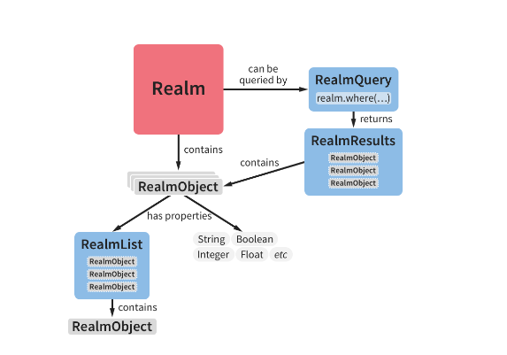

Realm数据库官方地址：https://realm.io/docs/java/latest
Realm由C++编写而成，是跨平台的数据库框架。

# 依赖引入

依赖的引入：
项目级别的`build.gradle`新增如下内容:
```
buildscript {
    repositories {
        jcenter()
    }
    dependencies {
        classpath "io.realm:realm-gradle-plugin:4.3.1"
    }
}
```
需要使用Realm的模块级别的`build.gradle`添加如下内容：
```
apply plugin: 'realm-android'
```

只有同步依赖，便引入了Realm的数据库依赖。

# 数据库概览

Realm数据库框架有5个重要的类。
  
* Realm
    Realm数据库，负责对象的持久化存储和事务的管理，RealmObject的增删查改以及事务的处理均依赖于此。
* RealmConfiguration
    用于数据库实例的配置
* RealmObject
    存储在Realm数据库中所有对象的超类，只有RealmObject的子类才能被存储进Realm数据库
* RealmList
    RealmObject的List,对应着一对多的关系
* RealmQuery
    用于查询Realm数据库
* RealmResults
    查询结果集，Realm是实时，自动更新的。

# 数据库基本使用
