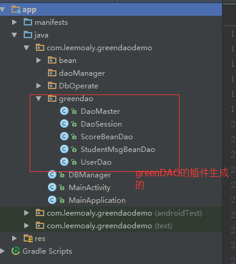
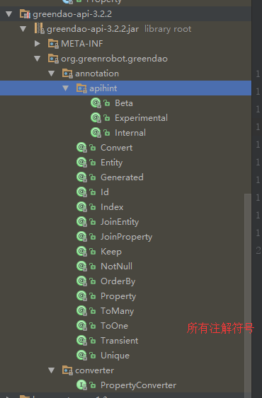

>https://github.com/greenrobot/greenDAO

项目级别的build.gradle的buildscript添加如下代码:
```
buildscript {
    repositories {
        jcenter()
        //greenDAO需要的仓库
        mavenCentral() // add repository
    }
    dependencies {
        classpath 'com.android.tools.build:gradle:2.3.2'

        // NOTE: Do not place your application dependencies here; they belong
        // in the individual module build.gradle files
        //add greenDAO需要的依赖
        classpath 'org.greenrobot:greendao-gradle-plugin:3.2.2'
    }
}
```

模块级别的build.gradle添加
```
//add greendao 依赖
apply plugin: 'org.greenrobot.greendao'
//从官方给的例子来看是将greendao和android{...}列为同级
greendao {
    schemaVersion 1 //数据库版本
    //由greenDAO的插件生成的代码存放的位置,不指定目录时将存在于app/build的某个子目录下
    daoPackage 'com.leemoaly.greendaodemo.greendao' //设置DAOMaster，DAOSession，DAO的包名,
    targetGenDir 'src/main/java' //设置DAOMaster，DAOSession，DAO的目录,一般默认为src/main/java

}
  //在dependencies中添加依赖
    // add greendao 依赖
    compile 'org.greenrobot:greendao:3.2.2'
```

新建实体类StudentMsgBean(自定义字段，先不写构造以及getter,setter方法)
```
@Entity
public class StudentMsgBean {
    @Id
    private Long id;
    @Property(nameInDb = "STUDENT_NUM")
    private String studentNum;
    @Property(nameInDb = "NAME")
    private String name;
    @Property(nameInDb = "SCORE_ID")
    private Long scoreId;
}
```

创建好实体类后Rebuild project一下，  
  

* DAOMaster：
    * 是GreenDao的入口也是greenDao顶级对象,对于一个指定的表单持有数据库对象（SQLite数据库）并且能够管理DAO类- 能够创建表和删除表 
    * 其内部类OpenHelper 与DevOpenHelper是创建SQlite数据库的SQLiteOpenHelper的具体实现 
* DAOSession
    * 对于一个指定的表单可以管理所有的Dao 对象。 
    * 也能够对实体类执行 insert ,load，update,refresh.delete操作。 
    * DaoSession也能跟踪 identity scope：即session查询后的实体会存在缓存中，并给该实体生成一个flag来追踪该实体，下次再次查询时会直接从缓存中取出来而不是从数据库中取出来 
* xxxxDao:
    - 由实体类经greenDAO插件生成，有多少个Entity注解修饰实体类，就有多个个这样的类，类名为实体类的类名+Dao。
    - 能够持久访问和查询实体类 
    - 比起DaoSession有更多的持久化方法 count, loadAll,insertInt等等； 

**Model类(实体类)与注解符号**  

| 符号 | 作用 |
|:--:|:--:|
| @Entity | 告诉GreenDao 该Bean类需要持久化。只有使用@Entity注释的Bean类才能被dao类操作; |
| @Id | 主键 |　一般会选择long/Long属性作为EntityID（即数据库中的主键）autoincrement=true表示主键会自增如果false就会使用旧值　|
| @Property |　可以自定义一个该属性在数据库中的名称，默认情况下数据库中该属性名称是Bean对象中的 属性名但是不是以驼峰式而是以大写与下划线组合形式来命名的比如：customName将命名为 CUSTOM_NAME;注意：外键不能使用该属性｜
| @NotNull  | 确保属性值不会为null值; | 
| @Transient | 使用该注释的属性不会被存入数据库中; |
| @Unique | 将属性变成唯一约束属性;也就是说在数据库中该值必须唯一 | 
| @Generated | 提示开发者该属性不能被修改；并且实体类的方法，属性，构造器一旦被@Generated注释就不能被再次修改，否则或报错 |

GreenDAO的所有注解符号如下：在greendao-api-3.2.2.jar中可以清晰看见。　　　　
　　

|　注解符号 |　功能  |
|:--:|:--:|  
| @Convert | |
| @Entity |　告诉GreenDao 该Bean类需要持久化。只有使用@Entity注释的Bean类才能被dao类操作; |
| @Generated |　 GreenDao运行所产生的构造函数或者方法，被此标注的代码可以变更或者下次运行时清除 提示开发者该属性不能被修改；并且实体类的方法，属性，构造器一旦被@Generated注释就不能被再次修改，否则或报错|
| @Id |　主键 Long型，可以通过@Id(autoincrement = true)设置自增长。通过这个注解标记的字段必须是Long，数据库中表示它就是主键，并且默认是自增的。 |
| @Index | 使用@Index作为一个属性来创建一个索引；定义多列索引(@link Entity#indexes())　|
| @JoinEntity | |
| @Keep | |
| @NotNUll | | 
| @OrderBy | | 
| @Property | |
| @ToMany | | 
| @ToOne | |
| @Tranisent | |
| @Unique | |
