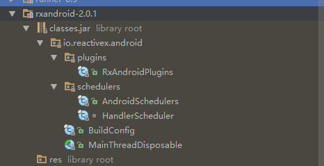
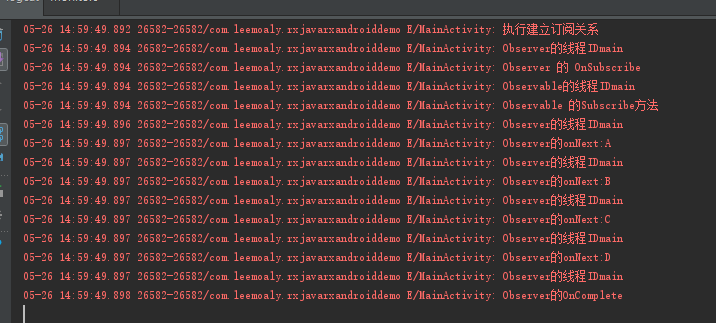
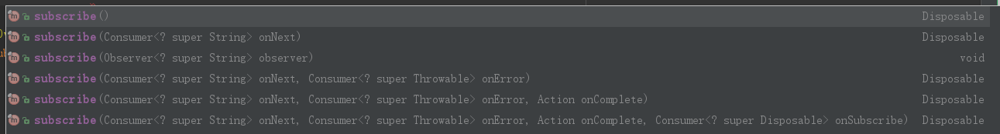
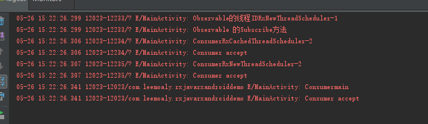
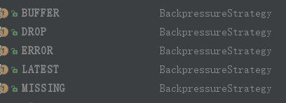

[TOC]

RxJava-Reactive Extension for JVM -a library for composing asynchronous and event-based programs using observable sequences for the Java VM.
>  RxJava2.0和Rxjava1.0相比，2.0基于Reactive_Stream规范完全重写。1.0和2.0的用法存在很大的差异。本文基于RxJava2.1.0进行讲解。

RxJava是响应式编程在JVM上的扩展，该库在JavaVM上使用可观测的序列，可用于创建异步和基于事件的应用。

而RxAndroid是JakeWharton基于RxJava2.0对Android平台做的响应式编程扩展。RxAndroid让编写响应式的组件更加轻松无忧。在主线程或者含有Looper的线程上RxAndroi提供调度器(Scheduler)进行线程的切换。  
  


# 基础概念
## 观察者模式
RxJava基于观察者模式，观察者模式说明如下：
在对象间定义一个一对多的联系性，由此当一个对象改变了状态，所有其他相关的对象会被通知并且自动刷新。要素：观察者(Observer)，被观察者(Observerable),订阅(subscribe)。被观察者observable是事件的发起者，当事件发生时被观察者主动向所有存在订阅关系的观察者发送通知。观察者接收，处理事件。
**RxJava的四个基本概念**  
RxJava 有四个基本概念：Observable (可观察者，即被观察者)、 Observer (观察者)、 subscribe (订阅)、事件。Observable 和 Observer 通过 subscribe() 方法实现订阅关系，从而 Observable 可以在需要的时候发出事件来通知 Observer。

与传统观察者模式不同， RxJava 的事件回调方法除了普通事件 onNext() （相当于 onClick() / onEvent()）之外，还定义了两个特殊的事件：onCompleted() 和 onError()。

1. onCompleted(): 事件队列完结。RxJava 不仅把每个事件单独处理，还会把它们看做一个队列。RxJava 规定，当不会再有新的 onNext() 发出时，需要触发 onCompleted() 方法作为标志。

2. onError(): 事件队列异常。在事件处理过程中出异常时，onError() 会被触发，同时队列自动终止，不允许再有事件发出。

在一个正确运行的事件序列中, onCompleted() 和 onError() 有且只有一个，并且是事件序列中的最后一个。需要注意的是，onCompleted() 和 onError() 二者也是互斥的，即在队列中调用了其中一个，就不应该再调用另一个。
 

# 基本操作

RxJava的实现主要为三点

1. 创建观察者Observer
2. 创建被观察者Observable
3. 订阅subscribe
代码实现如下：
```
 public void standardStremUseSeparate(){
        //创建被观察者
        Observable<String> observable=Observable.create(new ObservableOnSubscribe<String>() {
            @Override
            public void subscribe(@NonNull ObservableEmitter<String> e) throws Exception {
                Log.e(TAG,"Observable 的Subscribe方法");
                e.onNext("A");
                e.onNext("B");
                e.onNext("C");
                e.onNext("D");
                e.onComplete();
            }
        });
        //创建观察者
        Observer<String> observer=new Observer<String>() {
            @Override
            public void onSubscribe(@NonNull Disposable d) {
                Log.e(TAG,"Observer 的 OnSubscribe");
            }

            @Override
            public void onNext(@NonNull String s) {
                Log.e(TAG,"Observer的onNext:"+s);
            }

            @Override
            public void onError(@NonNull Throwable e) {
                Log.e(TAG,"Observer的OnError"+e.toString());
            }

            @Override
            public void onComplete() {
                Log.e(TAG,"Observer的OnComplete");
            }
        };
        //建立订阅关系
        Log.e(TAG,"执行建立订阅关系");
        observable.subscribe(observer);
    }
```

标准的流式写法如下：
```
public void standardStreamUse(){
        Observable.create(new ObservableOnSubscribe<String>() {
            @Override
            public void subscribe(@NonNull ObservableEmitter<String> e) throws Exception {
                e.onNext("A");
                e.onNext("B");
                e.onNext("C");
                e.onNext("D");
                e.onComplete();
            }
        }).subscribe(new Observer<String>() {
            @Override
            public void onSubscribe(@NonNull Disposable d) {
                Log.e(TAG,"Observer onSubscribe");
            }

            @Override
            public void onNext(@NonNull String s) {
                Log.e(TAG,"Observer onNext"+s);
            }

            @Override
            public void onError(@NonNull Throwable e) {
                Log.e(TAG,"Observer onError");
            }

            @Override
            public void onComplete() {
                Log.e(TAG,"Observer onComplete");
            }
        });
    }
```
上述例子中程序执行结果如下:    
    

注意：只有观察者和被观察者建立订阅关系，被观察者才会开始发送事件。  
解释一下其中的：ObservableEmitter和Disposable.

ObservableEmitter： Emitter是发射器的意思，这个就是用来发出事件的，它可以发出三种类型的事件，通过调用emitter的onNext(T value)、onComplete()和onError(Throwable error)就可以分别发出next事件、complete事件和error事件。

但是，请注意，并不意味着你可以随意乱七八糟发射事件，需要满足一定的规则：

1. 上游可以发送无限个onNext, 下游也可以接收无限个onNext.
2. 当上游发送了一个onComplete后, 上游onComplete之后的事件将会继续发送, 而下游收到onComplete事件之后将不再继续接收事件.
3. 当上游发送了一个onError后, 上游onError之后的事件将继续发送, 而下游收到onError事件之后将不再继续接收事件.
4. 上游可以不发送onComplete或onError.
5. 最为关键的是onComplete和onError必须唯一并且互斥, 即不能发多个onComplete, 也不能发多个onError, 也不能先发一个onComplete, 然后再发一个onError, 反之亦然
注: 关于onComplete和onError唯一并且互斥这一点, 是需要自行在代码中进行控制, 如果你的代码逻辑中违背了这个规则, 并不一定会导致程序崩溃. 比如发送多个onComplete是可以正常运行的, 依然是收到第一个onComplete就不再接收了, 但若是发送多个onError, 则收到第二个onError事件会导致程序会崩溃.

介绍了ObservableEmitter, 接下来介绍Disposable, 这个单词的字面意思是一次性用品,用完即可丢弃的. 那么在RxJava中怎么去理解它呢, 对应于上面的水管的例子, 我们可以把它理解成两根管道之间的一个机关, 当调用它的dispose()方法时, 它就会将两根管道切断, 从而导致下游收不到事件.

> 注意: 调用dispose()并不会导致上游不再继续发送事件, 上游会继续发送剩余的事件.

另外, subscribe()有多个重载的方法:  
  
1. 不带任何参数的subscribe() 表示观察者不关心任何事件
2. 带有一个Consumer参数的方法表示观察者只关心onNext事件

## 线程切换 

通过被观察者Observable的两个方法subscribeOn和observerOn控制被观察者发送事件的线程和观察者接收处理事件的线程。
 subscribeOn() 指定的是上游发送事件的线程, observeOn() 指定的是下游接收事件的线程.

多次指定上游的线程只有第一次指定的有效, 也就是说多次调用subscribeOn() 只有第一次的有效, 其余的会被忽略.

多次指定下游的线程是可以的, 也就是说每调用一次observeOn() , 下游的线程就会切换一次。
在RxJava中, ��经内置了很多线程选项供我们选择, 例如有

Schedulers.io() 代表io操作的线程, 通常用于网络,读写文件等io密集型的操作
Schedulers.computation() 代表CPU计算密集型的操作, 例如需要大量计算的操作
Schedulers.newThread() 代表一个常规的新线程
AndroidSchedulers.mainThread() 代表Android的主线程
例子代码：
```
 public void standardStremUseSeparate(){
        //创建被观察者
        Observable.create(new ObservableOnSubscribe<String>() {
            @Override
            public void subscribe(@NonNull ObservableEmitter<String> e) throws Exception {
                Log.e(TAG,"Observable的线程ID"+Thread.currentThread().getName());
                Log.e(TAG,"Observable 的Subscribe方法");
                e.onNext("A");
                e.onComplete();
            }
        }).subscribeOn(Schedulers.newThread()).subscribeOn(Schedulers.io()).subscribeOn(Schedulers.computation()).
                observeOn(Schedulers.io()).doOnNext(new Consumer<String>() {
            @Override
            public void accept(@NonNull String s) throws Exception {
                Log.e(TAG,"Consumer"+Thread.currentThread().getName());
                Log.e(TAG,"Consumer accept");
            }
        }).observeOn(Schedulers.newThread()).doOnNext(new Consumer<String>() {
            @Override
            public void accept(@NonNull String s) throws Exception {
                Log.e(TAG,"Consumer"+Thread.currentThread().getName());
                Log.e(TAG,"Consumer accept");
            }
        }).observeOn(AndroidSchedulers.mainThread()).doOnNext(new Consumer<String>() {
            @Override
            public void accept(@NonNull String s) throws Exception {
                Log.e(TAG,"Consumer"+Thread.currentThread().getName());
                Log.e(TAG,"Consumer accept");
            }
        }).subscribe();
    }
```
运行结果如下：  
  

## Flowable

Flowable会涉及到一个概念:背压(BackPressure),背压是指Observable飞速发送超过operator或者subscriber能够消费事件能力的情况。背压会导致内存的快速增长甚至导致OOM。Flowable通过响应式拉取(reactive pull)方式解决背压问题。
和Observable和observer相似Flow able和Subscriber连用。以下是Flowable使用的基本代码:
```
public void standardFlowable(){
        Flowable<Integer> flowable=Flowable.create(new FlowableOnSubscribe<Integer>() {
            @Override
            public void subscribe(@NonNull FlowableEmitter<Integer> e) throws Exception {

            }
        },BackpressureStrategy.ERROR);
        Subscriber<Integer> subsriber=new Subscriber<Integer>() {
            @Override
            public void onSubscribe(Subscription s) {
                    s.request(20);
            }

            @Override
            public void onNext(Integer integer) {

            }

            @Override
            public void onError(Throwable t) {

            }

            @Override
            public void onComplete() {

            }
        };
        flowable.subscribe(subsriber);
    }
```

以上Flowable和以前的Observable用法上有两点明显区别：

1. 新增的参数BackpressureStrategy.ERROR
2. Subscriber的onSubscribe中的s.request(xxxx);

## 背压策略BackpressureStrategy
BackpressureStrategy有5种。


| 类型 | 表现 |
|:--:|:--:|
| ERROR | 直接抛出MissingBackpressureException异常 |
| BUFFER | 保留所有事件知道下游处理 |
| DROP | 丢弃存不下的事件 |
| LATEST | 只保留最新的事件|
| MISSING | |

## 响应式拉取reactive pull
Flowable通过响应式拉取解决背压问题即下游downstream告诉上游upstream自己的处理事件的能力，从而上游决定发送事件的个数。这便是s.request()方法的作用。

# 常见操作符


# 参考资料
1. [RxJava2.0的GitHub地址](https://github.com/ReactiveX/RxJava)
2. [掘金专栏-RxJava2.0](https://juejin.im/user/573dba2171cfe448aa97b7b0)
3. [RxJava2.0的操作符](http://reactivex.io/documentation/operators.html#alphabetical)
4. [RxJava官方资料](https://github.com/ReactiveX/RxJava/wiki/)