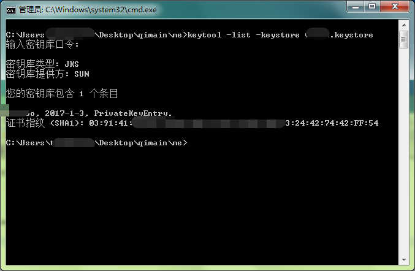
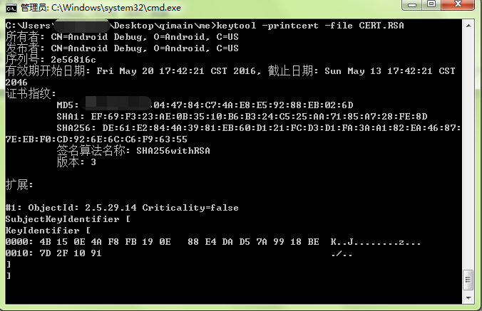
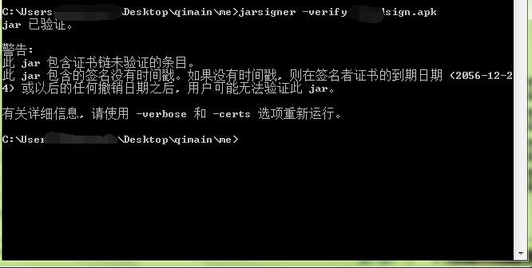

[TOC]  
# 相关名词 
# 常用命令集合
 1. jarsigner签名apk  
 `jarsigner -verbose -keystore abc.keystore -signedjar 123x.apk 123.apk abc.keystore`
 2. 查看keystore的信息  
 `keytool -list -keystore xxx.keystore`  
 
 3. 查看证书文件信息  
  `keytool -printcert -file CERT.RSA`  
  
 4. 验证apk是否已签名  
  `jarsinger -verify xxx.apk`  
  

查看keystore文件的详细信息
`keytool -v -list -keystore debug.keystore`
一般keystore的信息别名`androiddebugkey`,密码为`android`

`jks`和`keystore`两种格式

`keytool --list -v -keystore xxx.jks`


gradle中添加=签名文件配置，模块级别的`build.gradle`中添加
```
signingConfigs {
        release {
            keyAlias 'xxxx'
            keyPassword 'xxxxx'
            storeFile file('../xxxx.jks')
            storePassword 'xxxxx'
        }
    }
```

> storeFile file中的当前路径是模块级别的`build.gradle`所在的位置

然后再同级别的`buildTypes`节点中的需要用到签名的任务中使用
```
 buildTypes {
        release {
            minifyEnabled true
            proguardFiles getDefaultProguardFile('proguard-android.txt'), 'proguard-rules.pro'
            signingConfig signingConfigs.release
        }
    }
```


# 证书文件
常见的用于签名的文件
1. keysotre
2. jks


查询应用签名常用命令：

1. 解码apk得到 META-INF 目录，执行如下命令得到签名信息

```
C:\Users\seeksky\Desktop\kcb-sys\META-INF>keytool -printcert -file CERT.RSA
所有者: EMAILADDRESS=support@onyx-international.com, CN=Onyx, OU=R&D, O=OnyxInternational, L=Shenzhen, ST=Guangdong, C=CN
发布者: EMAILADDRESS=support@onyx-international.com, CN=Onyx, OU=R&D, O=OnyxInternational, L=Shenzhen, ST=Guangdong, C=CN
序列号: 9d40ce0cdd88dc15
有效期开始日期: Sat Jul 08 16:33:37 CST 2017, 截止日期: Wed Nov 23 16:33:37 CST 2044
证书指纹:
         MD5: 53:10:30:F0:EB:F9:3A:2F:8B:BC:76:B8:81:B5:72:07
         SHA1: 4C:BC:94:4E:9D:40:8D:4F:C2:5D:8C:F0:98:34:24:2C:2D:25:BB:24
         SHA256: 6F:14:E8:CD:AD:EF:63:7A:AA:39:E4:EF:AD:2D:FA:18:EB:CF:D2:08:82:78:6A:AB:E5:41:AF:C5:E4:20:59:C2
         签名算法名称: SHA256withRSA
         版本: 3
```

2. 重签名apk，重签名借助signapk.jar和.pem,.pk8证书文件

```
java -Xmx2048m -jar signapk.jar -w platform.pem platform.pk8 a.apk b.apk
```

# 常见问题  
1. jarsigner： 无法打开 jar 文件： ChangeBackgroundWidget.apk  
 碰到这种情况一般是执行签名命令`jarsigner -verbose -keystore xx.keystore -signedjar xxx_sign.apk xxx.apk alias`出现的，先保证命令的顺序没有问题，注意`xxx_sign.apk`代表的是签名后的apk文件，正常情况下应该还未生成，`xxx.apk`是即将被签名的文件。保证命令的参数没有传错后要保证路径的正确性即可用正常找到 ***xxx.apk*** 文件，网络上很多相关文章喜欢先将目录切换至jdk的bin目录下面执行`jarsigner`命令，这时要么传递 ***xxx.apk*** 的绝对路径进去，要么将 ***xxx.apk*** 拷贝至bin目录下面，总之要保证可以正常找到被签名的apk。
# 参考资料  
[Android签名与认证详细分析之一（CERT.RSA剖析）](http://myeyeofjava.iteye.com/blog/2125348)  
[查看第三方APK的签名的方法(.keystore .RSA .APK)](http://blog.csdn.net/u012067966/article/details/50477995)  
[APK签名原理](http://blog.csdn.net/kickxxx/article/details/18252881)  
[android签名中的公钥和私钥](http://blog.csdn.net/dacainiao007/article/details/17660215)