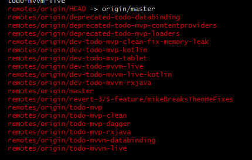

[TOC]

目录结构说明

# Android-Architecture
Google官方提供的App架构Sample。
`git clone git@github.com:googlesamples/android-architecture.git`
执行`git branch -a`查看仓库的所有分支。
  

按照Google的说法当前稳定的Sample有
1. `todo-mvp`,在仓库目录中`git checkout todo-mvp`即可切换至`todo-mvp`
2. `todo-mvp-clean` ,同理`git checkout todo-mvp-clean`
3. `todo-mvp-dagger`,`git checkout todo-mvp-dagger`
4. `todo-mvp-rxjava`,切换至`git checkout todo-mvp-rxjava`
5. `todo-mvvm-databinding`,切换至`git checkout todo-mvvm-databinding`
6. `todo-mvvm-live`,切换`git checkout todo-mvvm-live`