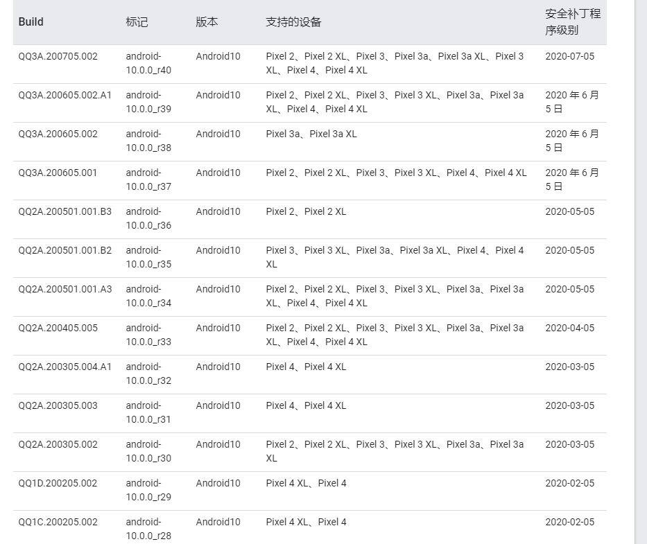

[TOC]

AOSP(Android Open Source Project) 就是Android的系统源码啦，AOSP 是由非常多的 git 仓库所组成，因此为了统一管理 Google 开发 Repo 基于Python 的命令行工具用于管理。Repo 的官方地址是  

https://gerrit.googlesource.com/git-repo/


https://android.googlesource.com/mirror/manifest/  

Manifest that contains all the projects that are hosted on the AOSP server. Useful when mirroring

这里只说如何在Windows上下载同步 AOSP 的方法，如果需要编译还是 Linux 吧

Google 官方提供的如何在 Windows 上使用 Repo 文档  

https://gerrit.googlesource.com/git-repo/+/HEAD/docs/windows.md

2020.07.23 

清华的镜像地址有点问题，比如 https://mirrors.tuna.tsinghua.edu.cn/help/AOSP/  页面说的 https://mirrors.tuna.tsinghua.edu.cn/git/AOSP/ 地址 我一直访问不了

# 准备 Repo 环境

Repo 实际上就是 Python 脚本因此在 Windows 运行需要 Python 环境，去官网下载 Python 并安装即可。 

下载 Git for Windows 并安装为后续操作做好准备

# 下载 Repo

从 Google 下载 repo，在终端和浏览器下载均可，下载完后将 repo 所在位置放入环境变量中以便后续命令的执行

命令方式，打开 git-bash终端

```
mkdir ~/bin
PATH=~/bin:$PATH
curl https://storage.googleapis.com/git-repo-downloads/repo > ~/bin/repo
# 如果下载不了那就使用科大镜像地址
curl -sSL  'https://gerrit-googlesource.proxy.ustclug.org/git-repo/+/master/repo?format=TEXT' |base64 -d > ~/bin/repo

# 或者使用清华的镜像地址
curl https://mirrors.tuna.tsinghua.edu.cn/git/git-repo -o repo
chmod +x repo
# 由于 Repo 在运行中会更新自己，所以可能需要再次替换一下更新URL，并重启终端
export REPO_URL='https://mirrors.tuna.tsinghua.edu.cn/git/git-repo'
# 赋予执行权限
chmod a+x ~/bin/repo
```

之后更新 Repo 工具

直接 repo init 数据量很大 故而 清华建议先下载一个最佳打包好的 tar，下载地址如下：

https://mirrors.tuna.tsinghua.edu.cn/aosp-monthly/aosp-latest.tar

2020.07 目前已经近 80G了，下载完后解压，再同步

```
tar xf aosp-latest.tar
repo sync 
# 加上 -l 参数可以只本地checkout 不访问网络
repo sync -l
```

仓库同步

```
repo init -u git://mirrors.ustc.edu.cn/aosp/platform/manifest
## 如果提示无法连接到 gerrit.googlesource.com，可以编辑 ~/bin/repo，把 REPO_URL 一行替换成下面的：
## REPO_URL = 'https://gerrit-googlesource.proxy.ustclug.org/git-repo'

# 只需要特定版本的Android
repo init -u git://mirrors.ustc.edu.cn/aosp/platform/manifest -b android-4.0.1_r1

# 上面的要是失败了尝试加入 worktree 参数
repo init -u https://aosp.tuna.tsinghua.edu.cn/platform/manifest -b android-10.0.0_r25 --worktree
```

可以通过  
https://source.android.com/source/build-numbers.html#source-code-tags-and-builds  

https://source.android.com/setup/start/build-numbers#source-code-tags-and-builds

  

得到Android版本和对应的分支


同步代码

```
repo sync 
```

替换已有仓库的镜像源，将 `.repo/manifests.git/config` 中的 

url = https://android.googlesource.com/platform/manifest

换成

url = git://mirrors.ustc.edu.cn/aosp/platform/manifest

如果 git 协议拉取不了，可以尝试 HTTP 的方式即改为 

url = http://mirrors.ustc.edu.cn/aosp/platform/manifest


repo sync 也可以只同步部分项目语法是 `repo sync projectname`，比如

```
repo sync platform/development 
repo sync platform/frameworks/base 
repo sync platform/packages/apps/Calculator
```

`projectname` 可以在 `.repo/manifest.xml` 中找到

Repo 工具设置代理 

```
export HTTP_PROXY=http://<proxy_user_id>:<proxy_password>@<proxy_server>:<proxy_port>
export HTTPS_PROXY=http://<proxy_user_id>:<proxy_password>@<proxy_server>:<proxy_port>
```

问题：
1. 如何使用windows下载AOSP源码
1. 如何通过国内镜像加速下载同步
2. 如果只下载特定的Android系统版本比如10.0
3. 如果只下载特定版本的最后一次版本，有点像只克隆深度为1即只包含最后一次commit内容的版本
5. 


需要替换的仓库地址：

.repo/manifests.git/config
.repo/manifest.xml

替换 https://android.googlesource.com

https://android.googlesource.com   --> 

url = https://android.googlesource.com/platform/manifest 
--> 
url = url = git://mirrors.ustc.edu.cn/aosp/platform/manifest

Repo 是 Google 用来管理 AOSP 的Unix/Linux命令行工具，想要在Windows运行Repo命令需要做一些准备工作。

https://juejin.im/post/5e3ad8376fb9a07c7e3d833d  

现成的Android系统源码地址：1.6~8.0
https://pan.baidu.com/s/1ngsZs#list/path=%2F

可能有用的连接
https://www.jianshu.com/p/ec1002fab3e9
https://www.jianshu.com/p/3922ec229077
https://juejin.im/post/5e3ad8376fb9a07c7e3d833d

# 参考资料
1. [AOSP(Android) 镜像使用帮助 [LUG@USTC]](https://lug.ustc.edu.cn/wiki/mirrors/help/aosp)
2. [Index of /aosp-monthly/](mirrors.ustc.edu.cn/aosp-monthly/)
3. [清华大学开源软件镜像站 | Tsinghua Open Source Mirror](https://mirrors.tuna.tsinghua.edu.cn/help/AOSP/)
4. [Git Repo 镜像使用帮助](https://mirrors.tuna.tsinghua.edu.cn/help/git-repo/)
4. [下载源代码  |  Android Open Source Project](https://source.android.com/source/downloading)
5. [repo - The multiple repository tool (also works on MS Windows!)](https://github.com/esrlabs/git-repo)
6. [阅读Android源码工具-SourceInsight](https://www.sourceinsight.com/trial/)
7. [下载AOSP android源码（最小最快下载方式，跳过编译直接导入Android Studio） Ubuntu 16.04](https://www.jianshu.com/p/3922ec229077)
8. [Windows安装repo的真正解决方案](https://juejin.im/post/5e3ad8376fb9a07c7e3d833d)