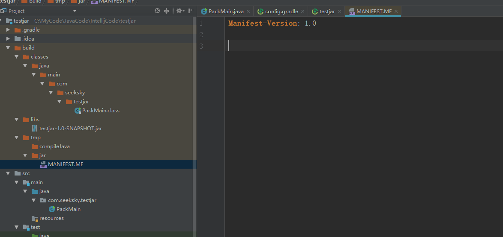
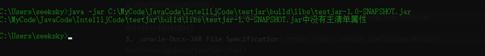

  Gradle 中的 Jar 任务是 Java插件新增的Task，可以直接执行 `gradle jar` 
执行打包Jar，执行的结果如下图:  
  

  libs 目录下的jar文件执行失败提示未配置属性。  
  

  在build.gradle中添加如下代码：
  ```
  jar {
    manifestContentCharset 'utf-8'
    metadataCharset 'utf-8'
    manifest {
        attributes 'Main-class' : "com.seeksky.testjar.PackMain"
    }

    from {
        configurations.compile.collect { it.isDirectory() ? it : zipTree(it) }
    }
}
  ```

> 指的注意的是 dependencies 需要使用compile代替implementation，不然会报找不到相关类的异常，

  上述就是打包一个fatJar(uberJar)的JAR的配置，所谓fatJar就是把所依赖的类抽取出
来打包到一个JAR文件中，JAR中包括JAR运行所需的所有依赖。定义一个Task来专门完成打包JAR文件：

```
def MainClassPath = "com.seeksky.testjar.PackMain"
task fatJarTask(type:Jar) {
    from {configurations.compile.collect{ it.isDirectory() ? it : zipTree(it)}}
    manifest {
        attributes 'Main-Class' : "${MainClassPath}"
    }
    with jar
}
```

> from 和 with 都是Task Jar的方法。


  执行 `gradle fatJarTask` 即可打包可运行的JAR文件。`manifest {}` 
其实就是JAR中常见的MANIFEST.MF

# 参考资料

1. [最全面的使用idea和gradle把java项目打包成jar的方法](https://my.oschina.net/u/2505383/blog/677301)
2. [Java中可运行Jar包的Classpath](https://blog.csdn.net/wenfengzhuo/article/details/10741825)
3. [oracle-Docs-JAR File Specification](https://docs.oracle.com/javase/8/docs/technotes/guides/jar/jar.html)
4. [Gradle编译全部依赖](https://blog.csdn.net/ymaini/article/details/81248705)