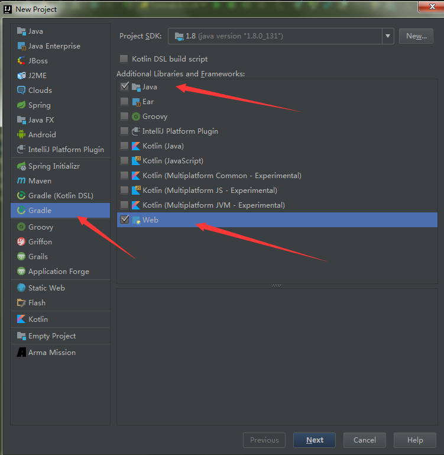
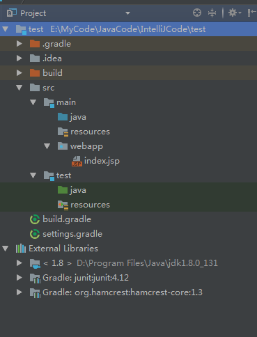
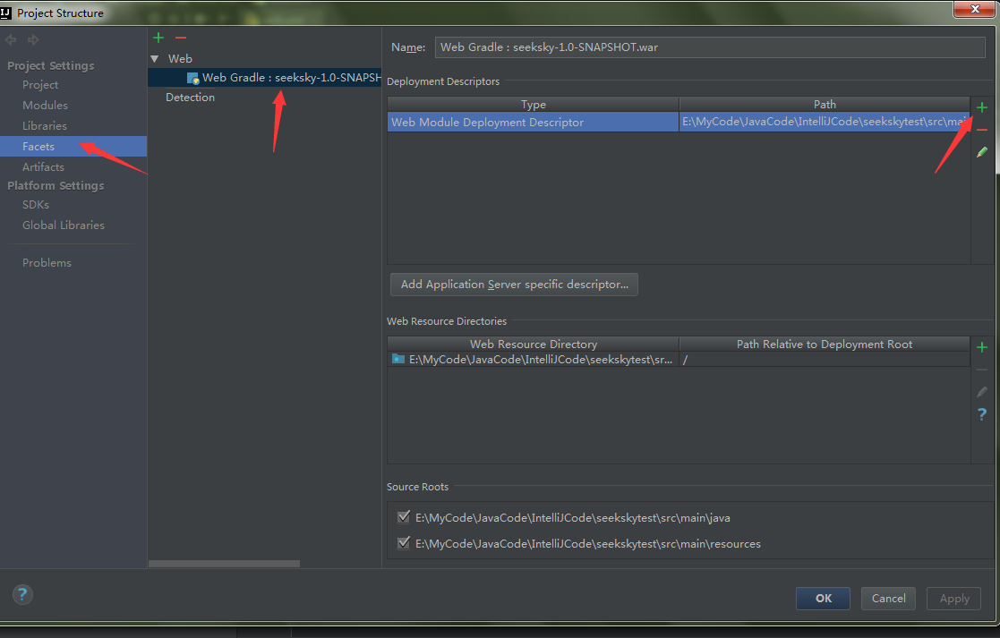
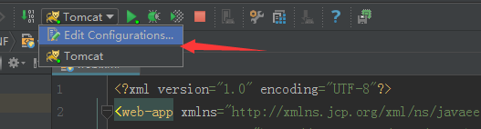
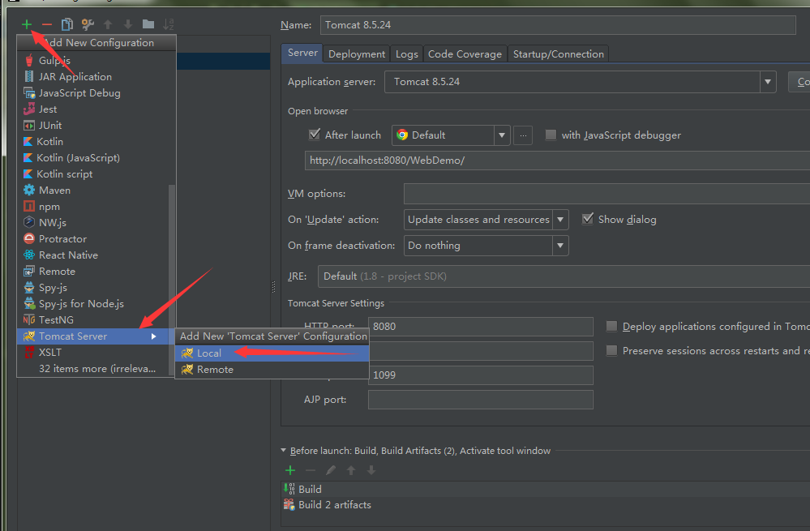
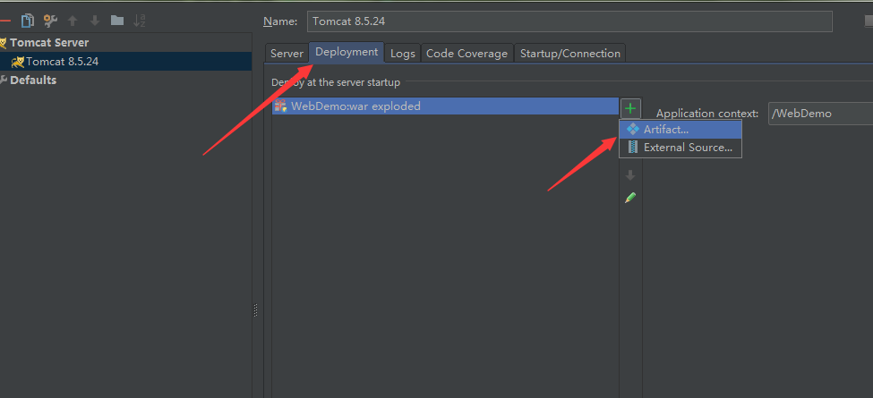
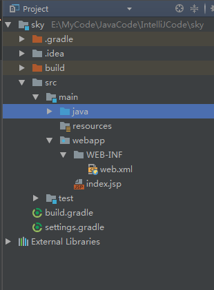
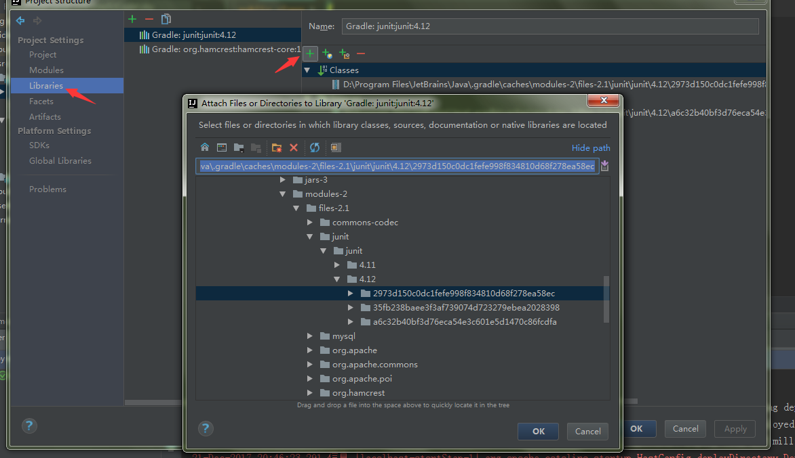

  环境搭建参考`Tools-IntellijIdea`目录下面的`Intellij+Tomcat构建JavaWeb环境`一
文。为了后期的方便管理使用Gradle进行依赖管理。`File-New Project`选择Gradle右侧勾选中Java和Web两项。
  
GroupId和ArtifactId看自己的喜好填写下，之后选择好Gradle所在的路径，输入项目的名称这样基于Gradle的JavaWeb项目构建完成了，  
  

从中可以看到创建的JavaWeb项目的文件并不完全，需要说明的是，最初创建的项目视图是不完整的，包括webapp文件夹下没有web.xml，以及src包下缺少Java文件夹(放置java源代码文件)，Resources文件夹（放置项目配置文件）。

创建Web.xml文件，打开项目结构图(Project Structure)  
  
修改下路径将生成的web.xml路径修改为`src\main\webapp\WEB-INF`下方  
  
选择新增一项  
  
切换至Deployment一栏  

选择第二项带exploded后缀的，之后Shift+F10或者点击运行按钮便运行程序，将自动打开浏览器显示localhost:8080页面。
一个标准的JavaWeb项目结构  

后续使用`HttpServlet`类是可能找不到该类，那是因为Idea默认没有导入`servlet-api.jar`包，用everything全局搜索下`servlet-api.jar`,添加下路径就好  
  

Run/Debug Configureration

Server-Open browser 里面的 `http://local:8080/` 这个是打开浏览器显示的网址
Deployment 右侧的Application Context 这里填写的是代码资源被虚拟到的环境地址也算映射地址