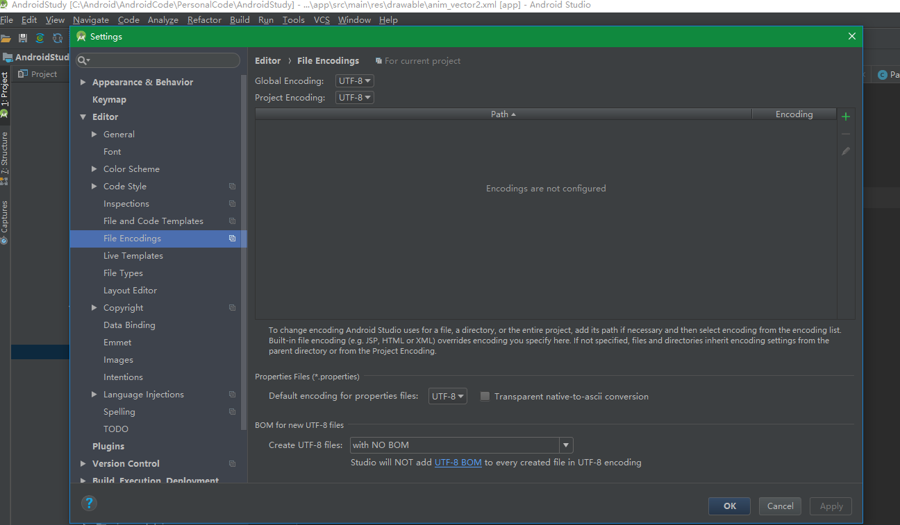
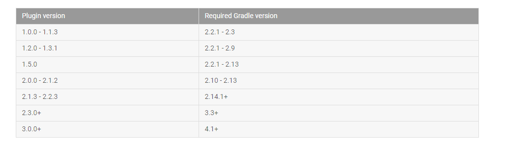

1. 悬停查看文档说明
File-Settings-Editor-General勾选
1. Show quick documentation on mouse move 
2. 自动导包功能
File-Settings-Editor-General-Auto Import
勾选
1. optimize imports on the fly
2. add unambiguous imports on the fly

# Android Studio卡占内存
1. 调整JVM虚拟机设置，在Android Studio顶部的菜单`Help-Edit Custom VM Options`,第一次使用时可能提示文件不存在点击yes创建即可，添加如下内容
```
# custom Android Studio VM options, see http://tools.android.com/tech-docs/configuration
-Xms256m
-Xmx2048m
```

> Xms为JVM分配的初始堆内存，Xmx为分配的最大内存。

当然你也可以直接去AS的安装目录下的`bin`目录直接修改相关配置文件,32位系统修改`studio.exe.vmoptions`，64位系统修改`studio64.exe.vmoptions`,总之需要调大xmx的数值。

之后稍微设置下在AS的`Settings-Apperance`，勾选`Show memory indicator `这样在项目中可以在右下角看到Heap 总大小以及使用状况。

之后如果用了一段时间很卡可以`File-Invalidate Caches/Restart`下

# 设置默认编码格式
File-Settings-Editor-File Encodings 

  


## 参考资料
1. [配置 Android Studio-Google官方文档](https://developer.android.google.cn/studio/intro/studio-config.html#adjusting_heap_size)
2. [Java HotSpot VM Options](http://www.oracle.com/technetwork/java/javase/tech/vmoptions-jsp-140102.html)

# Android Studio和Gradle
先搞清楚几个概念，Gradle是Gradle，Android Studio中的Gradle更多的指的` the Android plugin for Gradle`即Android的Gradle插件。在实际的安装目录上来说，
Gradle指的Android Studio安装目录下`xxxx\Android Studio\gradle`
Gradle插件指的Android Studio安装目录下的`xxx:\Android Studio\gradle\m2repository\com\android\tools\build\gradle`的具体文件
两者之间存在一定的对应关系，  
  
另外的还有Gradle编译时用到的缓存仓库
`GRADLE_HOME`和`GRADLE_USER_HOME`这两个环境变量，当没有设置这两个环境变量是Gradle编译项目是默认会在当前用户的目录`%userprofile%`,比如说`C:\Users\Administrator`下面创建隐藏文件夹`.gradle`，所有的依赖将会下载到这里。
## 参考资料
1. [Android Plugin for Gradle Release Notes](https://developer.android.google.cn/studio/releases/gradle-plugin.html)
