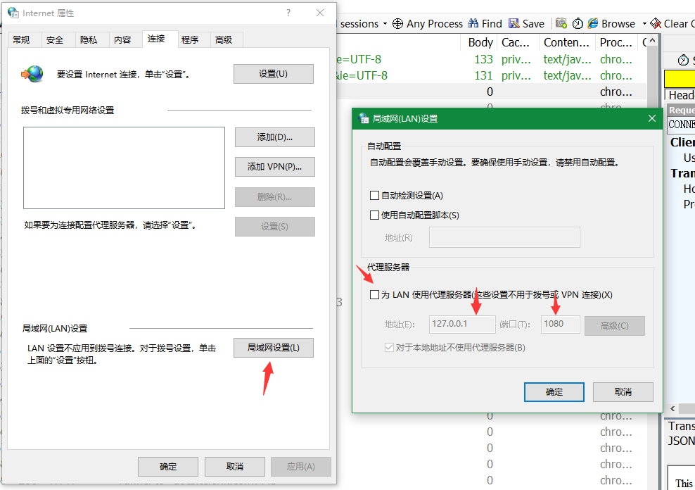
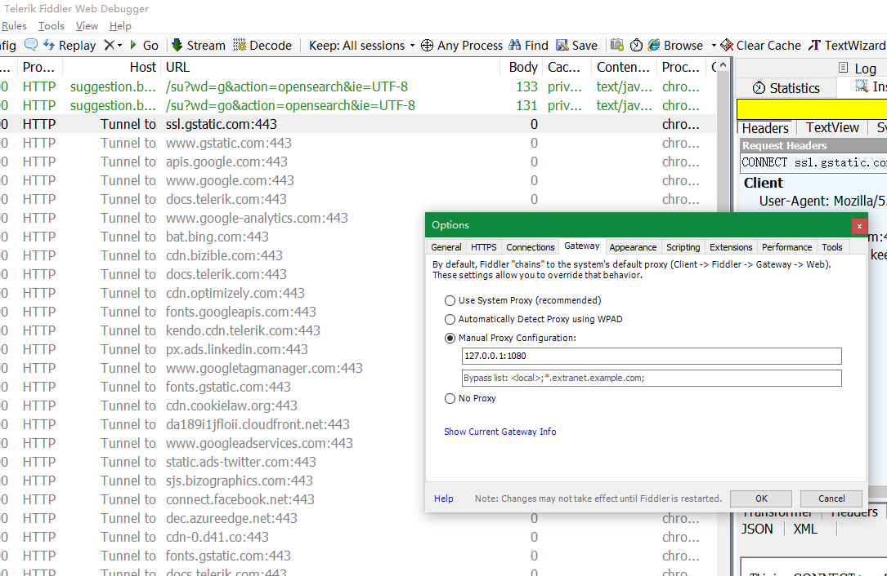

# Fiddler 代理
通常情况下流量的走向是客户端-Fiddler端口，但因为某些网站无法直接访问需要代理，流量的走向应该是客户端-Fiddler端口-代理端口。为了达到这个目的有两种常见的方式:

* 设置系统代理  
在网络设置-连接中找到  
  
填写代理地址

* Fiddler设置gateway  
上一种方式比较通用，这样电脑的所有数据都会走代理，如果不想让所有的流量都走代理只想把Fiddler的流量走代理可以通过tools-options-gateway，填写代理地址。  
  

最后点击 `show gateway info dialog` 看下是否正确。


https://blog.csdn.net/djzhao627/article/details/102812783

Android7.0 之后的 HTTPS 抓包问题，将Fiddler的证书放置至系统证书目录下，由于Fiddler正式是DER格式需要转化为pem方可

```
#1. 证书转换，已经是pem格式的证书不需要执行这一步
openssl x509 -inform DER -in FiddlerRoot.cer -out FiddlerRoot.pem 

#2. 进行MD5的hash显示

#openssl版本在1.0以上的版本的执行这一句
openssl x509 -inform PEM -subject_hash_old -in FiddlerRoot.pem

#openssl版本在1.0以下的版本的执行这一句
openssl x509 -inform PEM -subject_hash -in FiddlerRoot.pem
mv FiddlerRoot.pem 269953fb.0
adb root
adb remount
adb push 269953fb.0 /system/etc/security/cacerts
```


# 参考资料  
1. [Fiddler官方文档](http://docs.telerik.com/fiddler/KnowledgeBase/QuickExec)  
2. http://blog.csdn.net/ohmygirl/article/details/17855031
3. [Android中Fiddler的使用技巧](http://www.jianshu.com/p/4903a03a3816)  
4. [浅谈HTTPS以及Fiddler抓取HTTPS协议](http://www.jianshu.com/p/54dd21c50f21)
5. [fiddler的快速入门](http://www.jianshu.com/p/1e4e7fb7c4e6)
6. [抓包工具 Fiddler 相关知识总结](http://www.jianshu.com/p/4a8dae519efe)
7. [Fiddler实战深入研究(二)](http://web.jobbole.com/82710/)  
8. [Fiddler调式使用知多少(一)深入研究](http://web.jobbole.com/82706/)
9. [Chain Fiddler to an Upstream Proxy](https://docs.telerik.com/fiddler/Configure-Fiddler/Tasks/ChainToUpstreamProxy)