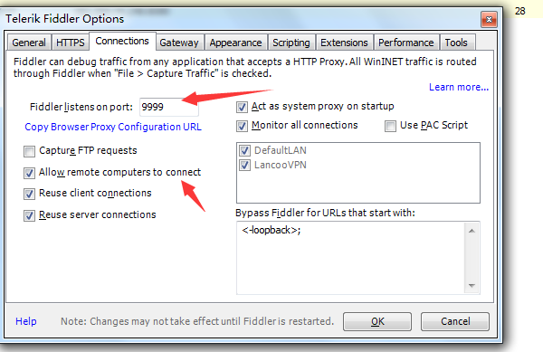
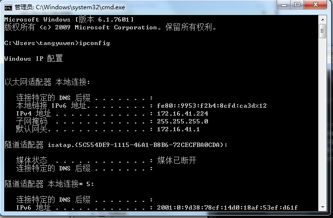
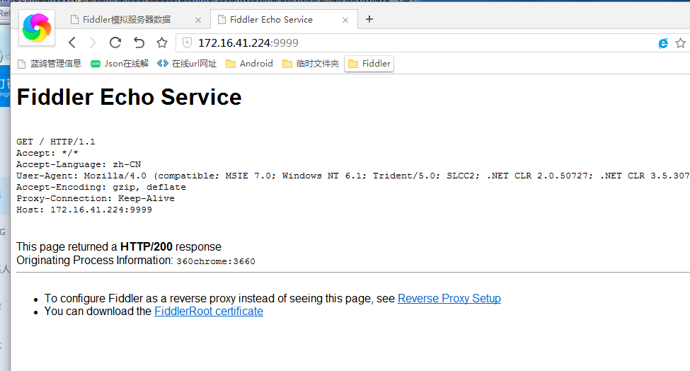
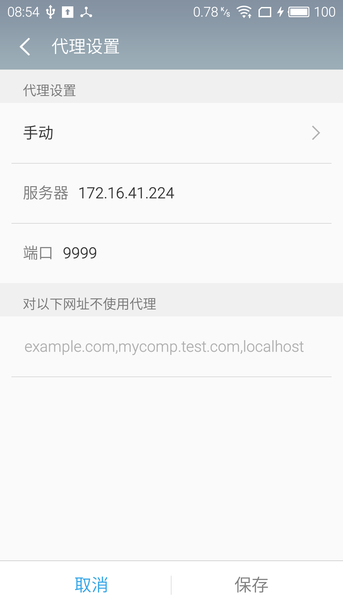
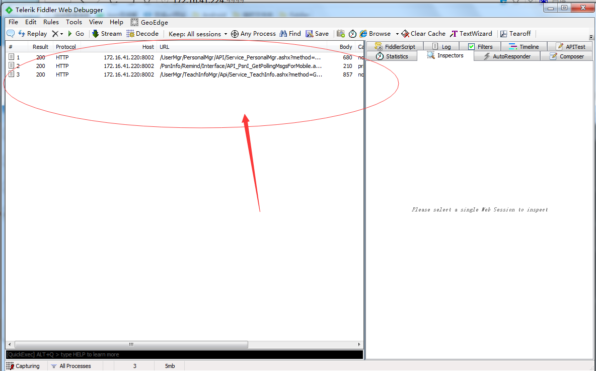
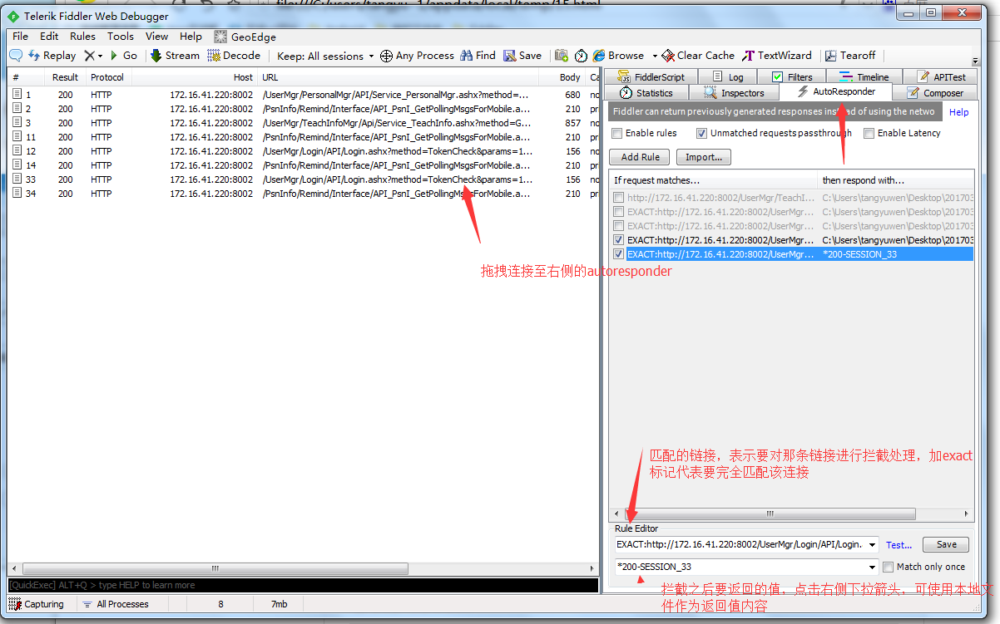
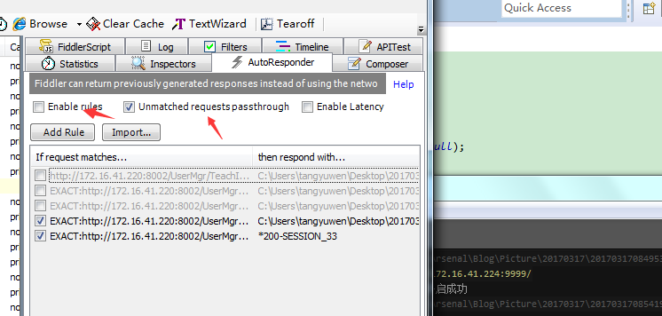

# Get Fiddler
[Fiddler官网](http://www.telerik.com/fiddler)
# 准备工作
1. 配置Fiddler  
    Tools-Telerilk Fiddler options-connections  
      点击确定，重启Fiddler。开启本地代理服务器。
    (因为云平台使用http链接就没有必要安装证书以及解密https等设置)
    win+R，键入ipconfig命令查看当前ip信息。  
      访问ip+端口9999,http://172.16.41.224:9999/ 可正常打开代表代理服务器开启成功  
      

2. 配置手机代理
    手机链接wifi，设置代理。  
     
    重启云平台。捕获云平台请求成功 
     

# 模拟数据
你必须勾选enable rules，并且下方添加了要处理的连接才能只能拦截和自动响应。同时勾选unmatched requests passthrough 避免拦截不必要的请求。  
  
  

