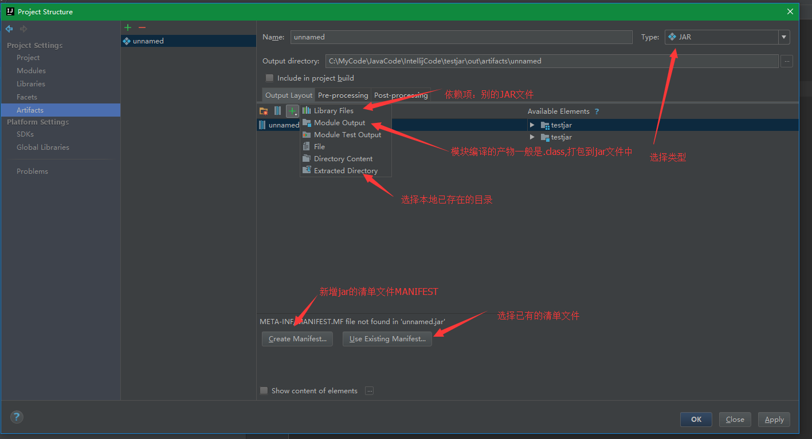
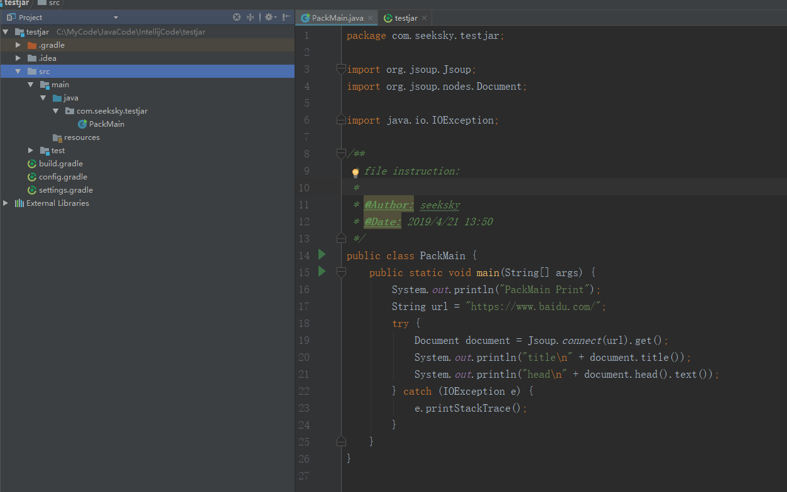
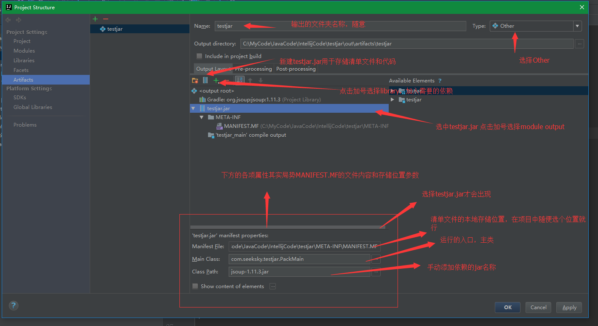
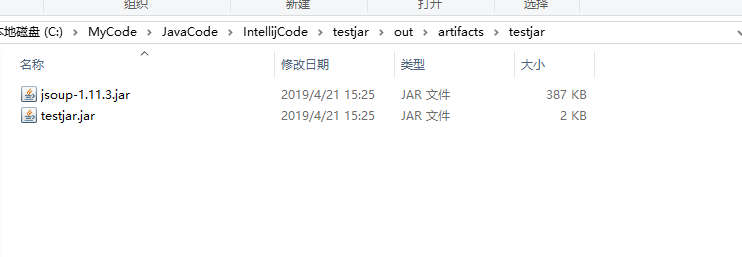
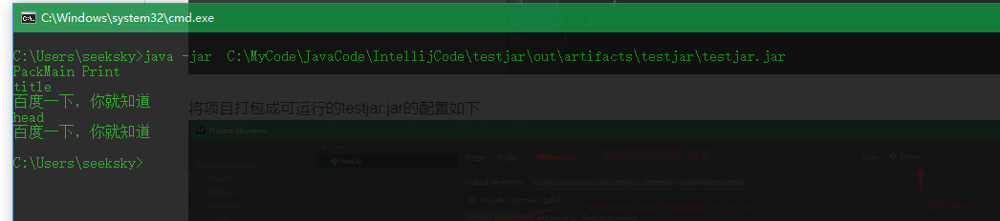
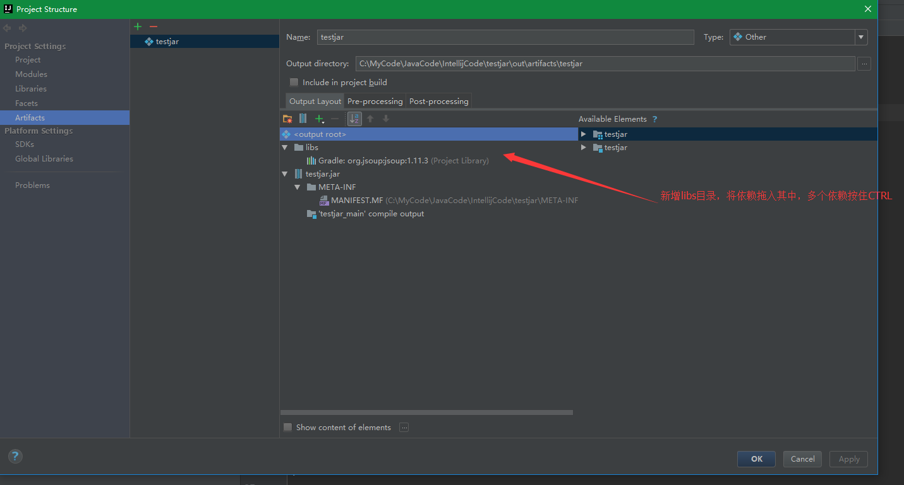
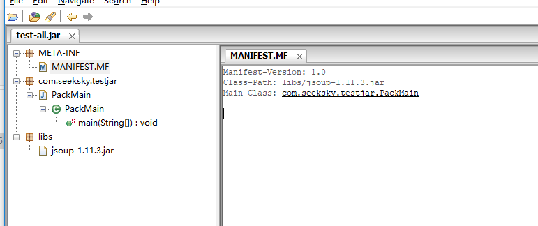

  JAR从功能上大致可以分为两类：可运行的和不可运行的。IntellijIdea导出JAR的步骤
基本一样，只是细节配置不同。

> JAR 文件的格式可以参考官方文档 https://docs.oracle.com/javase/8/docs/technotes/guides/jar/jar.html

  快捷键 CTRL+ALT+SHIFT+S 或者 File-Project Structure 进入项目结构视图
Project Settings-Artifacts, 点击上边绿色的加号，这里选择JAR-EMPTY，该项需要自己配置东西最多这里搞清楚了别的都好说。

  

  如上图，右侧的Type选择输出类型，JAR是将所有输出打包成一个JAR文件，Other的话输
出需要自己来配置，这里我们选择Other。先看下当前项目的结构：  
  

  将项目打包成可运行的testjar.jar的配置如下:  
  

  之后点击应用配置，回到项目主界面，点击上方的build-Build Artifacts-build，build完成后可以在 out-Artifacts 目录的结果如下图所示：  
  

  终端运行jar包的结果如下图:  
    

  从上上图可以看到 testjar.jar 和依赖 jsoup-1.11.3.jar 在同一个文件夹下，当依赖
很多的时候为了管理方便，建议将所有的依赖放入libs文件夹下，这里修改相关的配置:  
  

  这里提一下 MANIFEST.MF 的Class-Path的路径问题，首先MANIFEST.MF文件本身随便存
储在那个位置，MANIFEST.MF中Class-Path才是需要注意路径问题。MANIFEST.MF是testjar.jar的一部分，而libs和testjar.jar目录同级所以 Class-Path 需要修改为相对MANIFEST.MF的位置。

  要想运行 testjar.jar 文件需要整个 testjar 
文件夹的内容，如果直接把libs的依赖直接打包进 testjar.jar 是否可以正常运行了？ 答案是不行，会报NoClassFound的错误。
  

  fatJar(uberJar) 是常用来解决上述问题的手段，基本原理就是将testjar.jar依赖其他
jar中相关的类抽取出来，合并在一起。

# 参考资料

1. [Classpath in jar---java打jar包时注意点](https://www.cnblogs.com/anruy/articles/5982155.html)
2. [JAR包引用其它JAR包的classpath问题](https://blog.csdn.net/yishengreai/article/details/47417645)
3. [Java中可运行Jar包的Classpath](https://blog.csdn.net/wenfengzhuo/article/details/10741825)
4. [JAR 文件揭密](https://www.ibm.com/developerworks/cn/java/j-jar/index.html)

