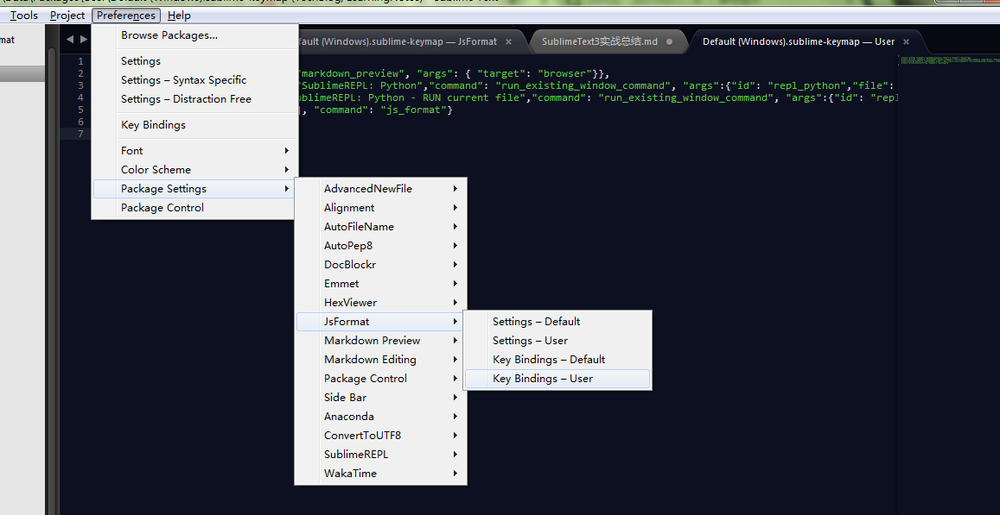

1. JsFormat没有效果
JsFormat是用于格式化`HTML,CSS,JS,JSON`的插件默认用来格式化代码的快捷键是`ctrl+alt+f`，安装了JsFormat没有反应多半是快捷键被占用，修改下快捷键就好.`Preferences-Package Settings-JsFormat-Key Bindings-User`
  

新增如下代码将快捷键修改为`ctrl+alt+shift+f`:
```
[
    ....
    {"keys": ["ctrl+alt+shift+f"], "command": "js_format"}
    ....
]

```

此后`ctrl+alt+shift+f`便可快速格式化JSON文件。