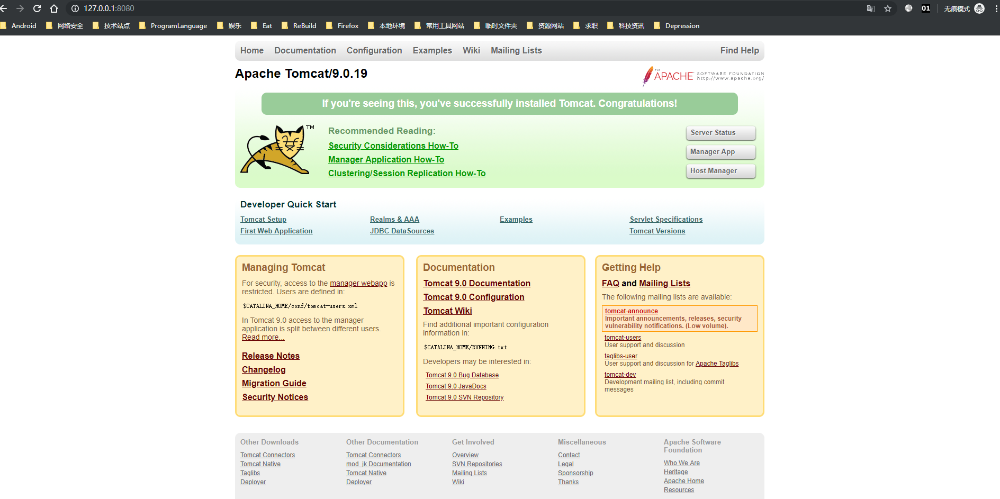

  Tomcat9 下载页面: https://tomcat.apache.org/download-90.cgi， 
之后配置到环境变量，通过 `bin/startup.bat` 启动服务器，Windows上可能会出现控制台启动输出日志出现乱码，需要修改使之编码一致,修改 `config/logging.properties` 文件中的 `java.util.logging.ConsoleHandler.encoding = UTF-8` 改为GBK。

  默认的端口号是 `8080`, 浏览器访问 `127.0.0.1:8080` 即可打开Tomcat服务器如下图
  

查看Tomcat的版本
bin目录下有version.bat和version.sh，终端里面执行就可以看到Tomcat的版本

http://archive.apache.org/dist/tomcat/ 存放着各个版本的Tomcat的源码

如果开发中需要关联源码，比如JSP开发中会引用到Servlet-api.jar,这时从上述地址下载好对应版本的源码，选择 `xxxxx.src\java` 就可关联到 servlet-api 的源码